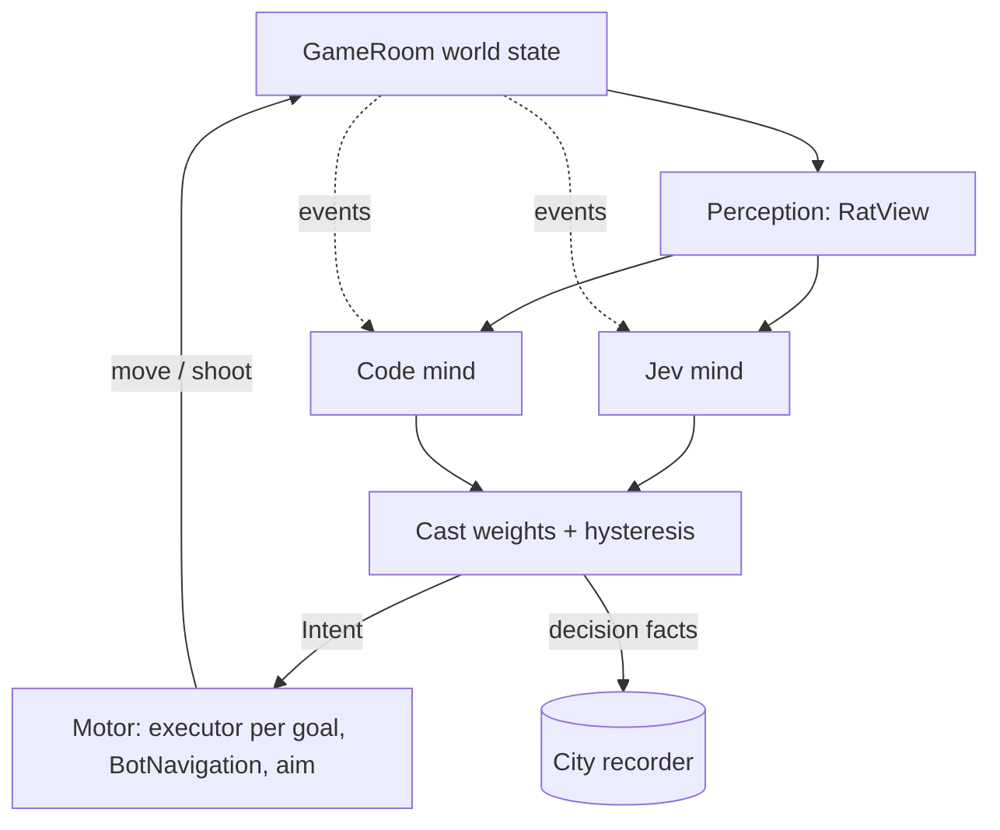

# Bot overhaul plan

Status (2026-09-30): **B0–B7 done: released to production** on Tyler's order ("Send it live… Don't ship it without input recording"). Production Worker `aecb77d2-8d51-4792-a5fb-af077c036c3d` runs motor iteration 2 with controls recording (`mindVersion` 3, commit `c878e52` on `main`, merged back into `bots/overhaul`). Staging Worker `820c8057-aa51-432b-89f7-084a502b1367`. **Motor iteration 3** (`mindVersion` 4, from the first human session; see "Motor rewrite") is committed on `bots/overhaul`, not yet deployed. This file owns the scope, order, decisions and acceptance of the bot overhaul. The visual version of the design, with diagrams, is [design/bots/overhaul-plan.html](../design/bots/overhaul-plan.html). Measurement uses [the city map](city-map.md).

## The idea

Every bot gets three parts:

- **Perception** (code, once a second and on events): what the rat can honestly see and hear, written in words the city map already uses (place names, floors, who is in view, what was heard).
- **Mind** (once a second and on events): chooses a goal, a target and a place.
  - **Jev mind:** [TypeSafe's Jev](https://docs.typesafe.ai/concepts/system-one.md), a model that answers typed questions with probabilities. It runs only in rooms with a human in them.
  - **Code mind:** free and instant. It runs the empty city and takes over whenever Jev is slow, down or over budget.
- **Motor** (code, every tick): moves, aims, dodges, fires and banks shots. It never waits for the mind; a rat always acts on its last goal.

Jev judges; code knows. Jev picks from candidates that code lists and never invents a target or place. Aim, distances, routes and bank angles stay in code.

## Decisions (Tyler, 2026-09-29)

- **Jev is the intent layer, not the hands.** A decision takes about 180 ms, so it can't steer a rat directly. It sets the plan, and the code carries it out.
- **The cast is 80 / 10 / 10:**
  - **Tryhards** (80%) play hard to win the assignment;
  - **Mavericks** (10%) win in their own way: bank shots, launcher ambushes, counterfeit traps;
  - **Gremlins** (10%) cause chaos.

  A personality is a set of weights applied in code to the same Jev answers, so it costs no extra calls. Each roster name keeps its personality across rounds. **Personalities are hidden from players**; the names are internal.
- **Skill is separate from personality.** Skill lives in the motor: reaction delay, aim error and fire cap. **Base bots never outplay Tyler.** Measured on `/map`, the bots' hit rate and kills per death stay below the median human's. There is one tier; a harder "nightmare" tier would be a later dial.
- **The living city stays.** With no human present, the code mind runs six to nine bots around the clock at no cost. Jev switches on when a human joins and off when the last one leaves.
- **Clean cutover, with a gate.** The new code mind replaces today's brain (`ObjectiveBotBrain` and its layers). Before production, it must match today's bots on the baseline (see "Acceptance").
- **Budget:** a **$25 a day** cap on Jev in production. When it is reached, rooms fall back to the code mind until the next day (UTC).
- **TypeSafe account:** the Rat Detective key is on **its own account**, so all 1,200 requests a minute belong to this game.
- **Release timing:** production **whenever the bots are ready**, on Tyler's OK after he has played the private preview. There is no need to wait for the layout-tuning week to finish: every fact carries both `layoutVersion` and `mindVersion`, so the data can be split.
- **Verification runs:** short private bot-only runs of the *new* bots are allowed (about 10 minutes on a hosted fixture; Jev capped at about $1 a run). Today's bots are still not soaked or tuned.
- **They keep getting better.** Every decision is recorded with its outcome. Changes are replayed against recorded moments before they ship, and each version changes one thing. Jev's own weights are not trained on our data; tuning happens in the questions, the situation text, the weights and the code.
- **"Better" means more fun and more humanlike, not stronger.**
- **Bots are equal participants (Tyler, 30 September).** A bot has exactly the tools and abilities a human has. It drives the same shared rat body with the same controls a player produces: move keys, look, jump, fire. Speed, acceleration, jumping, air control, Hot Pursuit, the hitbox and the fire-rate limit are shared code, not copies, and there are no bot-only movement rules or limits. Only two things differ, on purpose:
  - the mind (what to do);
  - skill (reaction, aim error and how fast the crosshair turns, through `SkillDials`), which keeps base bots below the median human.
- **Measure everything, the same way for everyone.** Human and bot inputs are recorded in the same control format (move keys, look, jump presses, trigger pulls; 20 times a second in fights), next to position and aim. The recorded controls are compared directly: alone, in pairs and all together (`scripts/motor-compare.mjs`), and moment by moment, by giving the bot's motor a recorded human situation and comparing its presses with the human's.

## Authority and boundaries

- Work on branch `bots/overhaul`. `main` stays releasable.
- Staging and private preview fixtures are allowed. **Production needs Tyler's explicit OK.**
- Previews use a frozen matching client and the hosted Worker with production server bots (6–9 bots rolled per round, humans on top, ten-rat cap). Agent browser checks stay muted (`&mute=1`); Tyler's playtests stay audible.
- The key never reaches a browser:
  - it is the Worker secret `TYPESAFE_API_KEY` (staging first);
  - the local copy is `~/.config/rat-detective/typesafe-key` on Veelox and Halla.

  Browser-hosted bots (`NormalGameBots`, `PracticeBots`) use the code mind only.
- Chosen player names never reach Jev; rats are sent as `r1`…`r9`.
- Pin the model version (`jev-1.13.0`), not `jev-latest`. Moving to a new release is a deliberate change, replayed first.
- Preserve everything in `AGENTS.md` that this plan does not change, in particular:
  - the ten-rat cap, 6–9 bots, persistent names, cap-only kicks;
  - the always-alive `public-live-v2`;
  - the 30 s and 90 s stuck rescues and loose-case recovery;
  - server authority over damage, scores and pickups;
  - imperfect aim;
  - Ironclad avoidance;
  - "the game always moves forward".

## Architecture (fixed)

- **Intent:** the one type both minds return. It holds a movement goal, an optional target rat, an optional place and a stance. The goals form a closed list, and code offers only the goals that are valid in the current assignment and situation. The list:
  - take the case;
  - chase the carrier;
  - keep the case (and deliver it in Paper Chase);
  - hold the zone (Jurisdiction);
  - hunt (close in on a rat);
  - flee;
  - heal;
  - arm up;
  - ambush;
  - mischief;
  - roam.
- **Firing is not a goal.** Humans fire in 75% of recorded moments, whatever else they are doing (B0). The motor fires whenever it has a shot or a useful bank, within the skill dials, whatever the goal. Goals are only about where to go and what to do there.
- **What Jev is asked, per rat, in one request:**
  - one Score per offered goal: how much sense it makes right now (five levels, from "makes no sense" to "clearly the best"). Code combines the scores with the cast weights and hysteresis. A single "which goal wins?" Choice is not used: in B0 it chose the objective every time and couldn't tell situations apart;
  - the target (Choice over visible rats, or none);
  - one place question per open-ended goal (Choice over candidate places);
  - danger (Score);
  - whether a bank shot is the way to reach the target (Noul).

  Questions in one request can't see each other's answers, so a goal that implies a place (the case, the carrier, a medkit, the zone, the delivery) takes that place from code.
- **The situation is written in words, not numbers.** Jev reads numbers badly: in B0, the case score rose as the case got *further* away when distances were given in units. Perception writes distances as run times or plain bands ("next to me", "a short run", "across the city"). It also states where the zone and the pickups are relative to the rat, and what lies between (open street, a fight).
- **Freshness:** each request carries a situation serial. An answer older than 1.5 s, or one that names a rat that is dead or out of view, is dropped. The code decides every 180–300 ms, as before. On each decision, the Jev mind returns its latest fresh answer, and it sends a new request once a second or on an event. Offered goals the answer didn't score take the code mind's score. With no fresh answer, the code mind decides.
- **Hysteresis:** a rat switches goal only when the new goal wins by a clear margin or an event fired (hit, case change, target lost, arrived).
- **Backoff:** a 429 or an error backs off exponentially, and the code mind covers in the meantime.
- **When Jev runs:**
  - at least one human playing in the room (connected, with real input in the last minute; staging included);
  - the key is set;
  - the day's spend is under the cap.
- **Daily cap:** each room adds up its own spend and reports it every 30 s or so to one `Matchmaker` Durable Object instance named `jev-budget`, the budget ledger. The Matchmaker class already exists in every environment, so nothing new needs migrating. The total per UTC day across rooms is checked against the `JEV_DAILY_BUDGET_USD` Worker variable ($25). A room that finds the day spent falls back to the code mind until the next UTC day.
- **Rate:** each room keeps under 600 requests a minute, half the account's limit, so a second busy room still fits.
- **Cadence:** one decision a second per rat, plus events. At about 1,700 tokens a decision, one room of nine rats costs about $2.30 an hour and uses 540 of the 1,200 requests a minute.
- **`mindVersion`:** a constant in code, stamped on every city fact next to `layoutVersion`, and raised by each change to the minds, questions, weights or dials.

## What happens to the code

- **Kept:**
  - `BotNavigation.ts` and `BotLaunchRoutes.ts` (flow fields, routes, launcher routes);
  - `ServerBotController.ts` (physics body, movement, rescues), which now drives executors;
  - `botRoster.ts`, which also rolls each rat's personality;
  - `BotTargeting.ts` and the imperfect aim in `BotCombat.ts`.
- **Reused:**
  - `src/worker/city/CityRecorder.ts` and `src/shared/city/places.ts` supply perception's vocabulary;
  - the recorder gains `decision` facts.
- **New, under `src/shared/bots/`:**
  - `intent.ts`, the shared contract: goals, personalities, `Plan`, `MindAnswer`, `Decision`, skill dials;
  - perception (B3);
  - `goals.ts`: which goals are offered, and the plan code makes for each one;
  - the code mind;
  - the cast (weights, hysteresis, sampling, skill dials);
  - the motor, with a bank-shot solver.

  The Jev mind (client, freshness, backoff, budget) lives in the Worker.
- **Split, then deleted:** `ObjectiveBotBrain.ts` is two things in one file, and both survive in new homes:
  - its deciding half (the priority ladder: case, intercept, carrier, zone, delivery, evade, combat, explore, with pickup, armour and alarm-pillar detours) becomes `goals.ts` plus the code mind's scores;
  - its moving half becomes the motor: routes, launches and flights, local steps, case approaches, obstacle jumps, zone holding, strafing, Ironclad caution, aim, fire, speculative corner fire, the turn rate and trap avoidance.
- **Moved into the motor, unchanged in behaviour (until the motor rewrite, below):** `BotManeuver`, `BotAttention`, `BotPurposefulHolding` (zone holding), `BotOpportunisticFire` (corner fire) and `zoneStepSafe`. The rewrite replaced all but `zoneStepSafe`. The experiment switch goes: `BotExperiments`, the unused non-default `BotZoneHolding` class, and the capacity-fixture modes that only switch between them.
- **Tests:** 26 test files name the old brain or its layers. They drive the new composed bot (the tryhard code mind plus the motor), with the same step signature, so their behaviour still has to hold. Tests of experiment switching are deleted.

## Order of work

Each step lists what it delivers and how it is proven.

### B0. Offline test on real moments (done, 29 September)
- Built situation text from 326 recorded human moments in `output/city/city.db` (10 rounds, layouts 2 and 3; mostly one or two players). Asked Jev the draft questions, and compared its answers with what the human actually did in the next 6 seconds.
- Measured response time from inside a Cloudflare Worker.
- Result: the design holds, with three changes, now in "Architecture":
  - firing moves to the motor;
  - goals are scored one by one;
  - situations are written in words.

  Details under "Evidence so far".

### B1. Baseline (tool done, 29 September)
- `scripts/bot-gate.mjs` computes the gate numbers from `output/city/city.db` for any room, layout, time window or `mindVersion`:
  - time and deaths per place (spread);
  - fire and hit rates, kills and deaths per bot-hour;
  - the banked-hit share (null while bot balls aren't recorded one by one);
  - rescues per bot-hour (from the `rescue` fact, recorded since B2b; for the baseline's bots, which had no such fact, an estimate from teleports in the frames);
  - case takes, deliveries and respawns per room-hour;
  - the median human's hit rate and kills per death.
- The first 9.4 bot-hours on layout 3 give:
  - about 1.6 rescues per bot-hour;
  - 205 places visited, with the top 10 holding 38% of bot time;
  - deaths in 103 places, with the top 5 holding 28%;
  - 80 shots a bot-minute at a 4% hit rate, and 0.92 kills per death;
  - 216 case takes and 10.5 deliveries per room-hour.

  The median human hit 7.1% (only 5 human rats). The final baseline window is re-run at the gate, covering every hour of today's bots on layout 3.

### B2. Intent, motor and code mind (the cutover)
- The Intent type, one executor per goal, the bank-shot solver, the code mind, the cast and the skill dials.
- The old brain and its layers are deleted, and the browser-hosted bots move to the code mind.
- Proof:
  - behaviour tests for each executor, written failure-first;
  - a short hosted bot-only run;
  - the code-mind gate (see "Acceptance").
- **Built (B2b):**
  - **Cast** (`src/shared/bots/cast.ts`): personality weights multiply a mind's scores, so a boost never makes a senseless (0) goal sensible:
    - mavericks: ambush ×1.6, hunt ×1.15;
    - gremlins: mischief ×1.8, roam ×1.25, hunt ×1.1, keep the case ×0.85.

    A tryhard on the code mind takes the top score, exactly as before. A Jev tryhard keeps its goal until another leads by one level of five, or an event fires. Mavericks and gremlins sample (softmax, temperature 0.75, their own seeded stream) and hold a sample for 2.5 s between beats. Offered goals an answer left out take the code mind's score; an answer that scored none of them gives way to the code mind.
  - **Personality** (`botPersonality` in `botRoster.ts`): a fixed FNV-1a hash of the roster name, 846 / 106 / 104 over the 1,056-name pool. The server derives it where the bot is driven; it is never sent.
  - **Skill dials** (`BASE_SKILL` in `intent.ts`): at B2b, today's numbers exactly (reaction 200–450 ms, aim error 2.8–5.6°, burst gaps 200–240 ms, 200 ms between motor shots). The motor rewrite redefined them (see "Motor rewrite").
  - **Bank shots** (`src/shared/bots/motor/bankShot.ts`): at a rat last seen at most 2.5 s ago within 35 units, now behind cover: six wall probes, then the shortest mirror bounce whose two legs check clear; at most 12 rays an attempt, one attempt every 600 ms, fired within 400 ms with the dials' aim error. Mavericks always; any rat whose answer's `bank` is at least 0.6.
  - **Gremlin fire:** a visible counterfeit with another rat within 5 units, from more than 10 units away; a launch trigger with another rat on its pad while the machine is not cooling; targets within 50 units. Gremlins also look for alarm pillars up to 90 units away (others 45).
  - **Parity:** with every bot a tryhard on the code mind, B2a and B2b match frame by frame (all four assignments, 6 and 10 rats, 60 s, seeded).

### B3. Perception
- `RatView` from the room:
  - place and floor;
  - HP and buffs;
  - the case;
  - visible rats (same sight rules as humans: 150 units, the Hunch at full HP);
  - sounds heard (shots, alarms, launcher throws);
  - candidate places.
- Proof: rendered views for recorded moments read correctly, and nothing a human couldn't know is included.
- **Built** (`src/worker/bots/perception.ts`, Worker-only, so the city's place names stay out of the client bundle):
  - a `Situation` object in words: the assignment's rule, standing and time pressure, me (place, level, HP as "3 of 5", buffs, carrying, hit a moment ago and by whom), the case, the zone, the drop-off, stocked pickups in sight, rats in view, a rat just gone behind cover, sounds heard, the Hunch and the Dispatch incident;
  - distances are run times at sprint speed ("right here", "a few steps", "a short run", "a long run", "across the city") with a compass direction and above/below; places are named without their coordinates (street, pier and quay names carry them, so they become "a north–south street in the west" and the like); no number reaches Jev except HP;
  - rats in view are the motor's own (80 units and a clear ray, the rays that aim), not the recorder's 150; the Hunch (within 40 at full HP) and sounds (gunfire within 60, alarm pillars, launchers within 100) have fields of their own, and an unseen shooter gets no alias;
  - rats are `r1`… for one request only, nearest in view first; a chosen name is never read.

### B4. Jev mind
- The Worker-side client with the question set, freshness, hysteresis, backoff, the $25 daily cap and on/off by human presence.
- Proof:
  - behaviour tests with a fake API (stale answers dropped, fallback on timeout, 429 and errors, the cap holds, no chosen name in any request, off without humans);
  - on staging, decisions flow;
  - cost and latency are logged per decision.
- **Built** (`src/worker/bots/`: `jevClient.ts`, `jevMind.ts`, `jevBudget.ts`; the ledger in `Matchmaker`):
  - **Questions**, one request per rat: a Score per offered goal ("How much sense does it make for `me` to pursue `goal` right now?", five levels, read straight onto the 0–4 scale); the target (Choice over rats in view and none, only when one is in view); a place Choice per open-ended goal with two or more options; danger (Score, four levels); the bank shot (Noul, only about a rat shot at in sight within the last 2.5 s, within 35 units, now behind cover). Every rat now remembers that quarry; only `tactics.bank` shoots at it.
  - **Freshness:** an answer plays for 1.5 s from when its situation was sent, while every rat it names is in view and no event (a case changing hands, a goal failing, the assignment moving on, a landing, a hit) has come since; otherwise the code mind decides.
  - **Cadence:** a rat asks at most once a second, at once after an event, never twice at once; the room holds to 9.5 requests a second with a burst of 10 (at most 580 a minute). Requests are fire-and-forget through `ctx.waitUntil`, with a 1.5 s timeout.
  - **Backoff:** any failure (429, 5xx, timeout, network, malformed reply) waits 1, 2, 4 … 60 s for the whole room, or longer if `retry-after` says so; the mind answers nothing meanwhile. The wait steps up once per outage: a failure of a request sent before the current wait began adds no step (only its `retry-after`), and only a success of a request sent since then ends the outage (review fix, 29 September).
  - **When:** only for server bots, while a human is playing, `TYPESAFE_API_KEY` is set and the day's budget is open. Playing means connected (not in reconnect grace) and real input in the last 60 s: joining, moving or turning (a pose that changed by more than .05 units or a rotation), firing, a hit claim or a pickup. An idle or background tab, which resends the same pose or only pings, turns Jev off after a minute (review fix). Switching resets no bot or route.
  - **Budget:** rooms report their spend ($0.042 per million input tokens) about every 30 s and when Jev switches off, to `Matchmaker` `jev-budget` (`jevSpend`, `jevBudget`), which sums rooms per UTC day, prunes earlier days and compares with `JEV_DAILY_BUDGET_USD` (unset means no Jev). A room stops as soon as its own unreported spend would pass the cap, and asks the ledger again on a new UTC day. It fails closed (review fixes): a failed ledger call forgets the day's total, so the room stops spending until a read 30 s later succeeds; a total not heard for 60 s (two report intervals) is not trusted, and one 30 s old is asked for again while it still holds. Each reply's cost goes to the budget as it lands (`JevMindOptions.spend`), so replies that land after Jev switched off, or after the bots were disposed, are reported at once; a report asked for while a ledger call is out runs when that call ends.
  - **Records for B5:** each Jev answer carries latency, tokens and send time (`MindAnswer.jev`); the mind counts decisions taken while on, requests, answers, failures, stale drops, fallbacks, throttled asks, tokens and dollars. Every minute while Jev is on, and when it switches off, the room logs that window's counts with latency p50/p90 and records them as a `minds` fact (B5). `MIND_VERSION` (1) is in `intent.ts`.
  - **Real check** (Halla, three situations): accepted, answers mapped to goals, place ids and rat ids; 196–394 ms, 1,464–1,892 input tokens a request.
  - **Config:** `JEV_DAILY_BUDGET_USD` and `JEV_MODEL` are Worker vars for the default and staging environments; production gets them with the secret at B7.

### B5. Recorder and `/map`
- `decision` facts are recorded for every Jev answer that is applied, and for every goal change on the code mind (a decision every 180–300 ms is too many to record each one). They hold:
  - the mind (Jev or code) and `mindVersion`;
  - the personality;
  - the goal and its top scores, raw and weighted;
  - latency and tokens;
  - whether the answer was dropped as stale;
  - the trigger.
- `goal-end` facts record the outcome when a goal ends: reached, died, replaced or failed, and how long it ran.
- A Minds layer on `/map`, and digest lines for the goal mix per personality, fallback share, latency and dollars per hour.
- **Built** (facts, aggregates, digest and page in [the city map](city-map.md); vocabulary in `src/shared/city/minds.ts`):
  - **`mindVersion`** is stamped on every city fact (`FactContext.mindVersion`), next to `layout`; the bot gate's `--mind=` filters on it.
  - **`decision`** (`CityRecorder.decision`, fed by `ServerBotCallbacks.decide` with each new `Decision`): recorded when a bot takes up a goal, or applies a Jev answer not yet recorded (one fact per answer, however many decisions reuse it). A code-mind decision under the same goal records nothing, so combat target churn and the 180–300 ms beat stay out. It holds the actor, point and place, mind, personality, goal, motor mode, trigger, the top three `[goal, raw, weighted]`, danger, whether a target was named, whether the motor had given up the previous plan (`Decision.failed`, from `BotMotor.failures`), Jev's latency and tokens, and, for a code decision while Jev was on, how Jev fared (`stale`, `fallback`).
  - **`goal-end`**: `reached` (per goal, as the city map defines it), `died`, `replaced` or `failed`, with the goal, mind, personality, motor mode, duration, where it was taken up and where it ended.
  - **`minds`**: the Jev mind's counts for each minute it is on (and the part-minute when it switches off), with latency p50/p90 and a 20 ms latency histogram so windows pool exactly.
  - **Aggregates:** `decide:<mind>:<personality>:<goal>` per place, `goal:<mind>:<personality>:<goal>:<outcome>` per place taken up, and `city_minds` for the Jev windows. Digest: a **Minds** section. Page: Observe's **Minds** layer. Gate: a `minds` section.
  - **Volume** (measured in a worker room, 9 bots, 45 s runs; the fake Jev scored goals at random every second, the worst case for churn): the code mind records 680–1,120 decisions and 520–970 goal ends per bot-hour (four runs); with Jev on, about 3,300 Jev decisions (at most one per answer, one answer a second), 290–440 code decisions and about 1,300 goal ends per bot-hour. A decision is about 460 bytes of JSON and a goal end about 420; gzipped in the archive, about 26 and 29 bytes. The bot-only city therefore archives about 10 MB a day more compressed (about 17 MB a day in all). Decisions and goal ends stay out of the 30-day SQL events (only the archive and the per-place counts keep them); the `minds` fact, one a minute, is kept there.

### B6. Preview on staging
- The gate run and Tyler's preview both use staging, not a capacity fixture:
  - staging runs `public-live-v2` with production-style bots and a matching client;
  - it records to its own archive (`rat-detective-city-staging`);
  - it has the Jev key.

  The fixture has no city archive, so it couldn't feed the gate.
- **Gate run:**
  1. deploy to staging;
  2. let the empty city run on the code mind for at least 10 minutes;
  3. mirror staging;
  4. run `bot-gate.mjs` against the production baseline.
- **Jev check:** a scripted protocol-23 client holds a connection so the room counts a human (about 10 minutes, roughly $0.40).
- Then Tyler plays staging (audible). Tune, then repeat.

### B7. Production
- The Worker secret, then the deploy, on Tyler's OK. Afterwards, one change per `mindVersion`, measured on `/map`.
- Done 30 September: Worker `aecb77d2-8d51-4792-a5fb-af077c036c3d`, client `index-D5qko-pp.js`. [Receipt](verification/bot-overhaul-release-2026-09-30.md).

## Acceptance

- **Code-mind gate (living city), measured against the B1 baseline on a hosted run:**
  - stuck anomalies and rescues per bot-hour are no higher;
  - deaths reach at least as many places;
  - the case changes hands and rounds finish at least as often;
  - nothing stalls the assignment.
- **Skill bar:** over human sessions on `/map`, the bots' hit rate and kills per death stay below the median human's.
- **Jev mind:**
  - a decision's p90 latency, measured from the Worker, stays under 600 ms;
  - with the key removed or the API failing, bots keep playing on the code mind with no visible stall;
  - the daily cap holds;
  - no chosen player name appears in any request.
- **Cost:** the digest shows dollars per human-hour, and the daily total never passes $25.
- **Repeatable artifact:** a receipt in `docs/verification/` with:
  - the baseline and new digests;
  - decision stats (goal mix per personality, latency p50 and p90, fallback share, dollars per hour);
  - side-by-side maps.
- **Checks:** `npm run typecheck`, the worker, client and script suites, and `npm run build`, run on Halla.

## Evidence so far

- **29 September probe** (`output/jev-probe/probe.mjs`, from Halla, `jev-1.13.0`):
  - a full five-question decision took about 180 ms (103–260 ms), and nine in parallel took 223 ms;
  - it used about 1,100 input tokens, and nine rats cost $1.47 an hour at one decision a second;
  - it made the right call in every hand-written test situation (loose case, dying, Ironclad, bank shot), and a player name written as an instruction didn't sway the goal;
  - in parallel questions, the place ignored the goal. Per-goal place questions fixed that (1.00 for the case's spot).
- **B0, real moments** (`output/jev-probe/real-moments.mjs` and `scores.mjs`; the moments are saved on Halla in `output/jev-probe/`):
  - **From Cloudflare:** a five-question decision took 65 ms at p50 and about 80 ms at p90 (36 calls, no errors). Nine in parallel took 130–296 ms. From Halla, it took about 200 ms.
  - **One "which goal?" Choice doesn't work.** It picked the objective whenever one was offered (case goals 122 of 122, the zone 63 of 63). Humans went for the case about 60% of the time and never stood in a zone in these rounds. Its confidence was the same when it matched the human (0.87) as when it didn't (0.85).
  - **Firing is constant.** Humans fired 3 or more shots in 75% of 6-second windows, so "fight" measures firing, not intent.
  - **Scoring goals one by one follows the situation where the text holds the evidence:**
    - heal separated medkit trips from the rest (AUC 0.89), scoring 2.00 at 1–2 HP and 0.03 at 5 HP;
    - flee scored 2.49 at 1–2 HP and 0.52 at 5 HP.
  - **Weak where the evidence was missing or numeric:**
    - arm up (AUC 0.59): pickups weren't described;
    - the zone (0.54): only "outside it";
    - the case (0.61): the score *rose* with distance given in units.
  - **Danger from text alone** separated rats who died in the next 6 seconds from those who lived: AUC 0.75, mean 1.30 against 0.66.
  - **Size:** 640–850 input tokens a request.
  - **Limit:** the human sample is small and mostly Tyler, so "humanlike" can't be measured well until more people play.
- **Stuck rescues: Pier 9 and roof landings** (29 September; staging's 30 rescues in 11.5 bot-hours, then sims on Halla):
  - **Pier 9 had no exit leg.** A far goal's route search restarts whenever the goal moves 7 units, so a bot chasing moving rats across the city often has no route. It walks straight at the goal instead, and from the quay-road spawn that line runs into Pier 9 and ends in the south-west corner of the mezzanine (11 of staging's 30 rescues) or in the harbour master's office. The walk graph itself was sound: the mezzanine connects to the whole city. `pier9ExitPoint` now sends a bot inside to the nearer stair foot, the office door or the better outer door first, as landmarks already do. That search is short and finishes at once.
  - **Building roofs aren't in the walk graph.** A bot thrown onto one by someone else's launcher had no route and no local step. Its escape waited for the 8-second stuck clock and stopped after 1.5 units, so it crept until the 90-second rescue. A stalled bot on a floor the graph lacks now walks off at once. The 30-second and 90-second rescues are unchanged.
  - **Sims:** 48 seeded 10-minute rooms (four assignments, six seeds, nine bots including two gremlins) gave 73 rescues before the fix and 41 after (2.03 and 1.14 a bot-hour). Rescues at Pier 9 fell from 21 to 0, and rescues on roofs after a launch from 2 to 0.
- **Code-mind gate in sims (30 September):** the same 48-run harness was run on the pre-overhaul bots (`23cb997`) and on `5a19806`, 36 bot-hours each. The new build ran with 6 tryhards, 1 maverick and 2 gremlins.
  - **Passes:**
    - rescues: 1.14 per bot-hour against 2.14;
    - no assignment stalled.
  - **Misses:**
    - case changes: 230 per room-hour against 247;
    - assignments finished: 5.25 per room-hour against 6;
    - Paper Chase deliveries: 30 against 49 per room-hour, with 1 win against 3;
    - death places: 135 against 144.
  - **Likely cause** [inference]: tryhards on the code mind are frame-identical to the old bots, so the gap comes from the non-tryhards and the Pier 9 exit legs. The sim had 3 non-tryhards in 9, more than the 80/10/10 mix gives, and gremlins weight keep-case at 0.85. **Open before production:** rerun with the real mix, and check whether mavericks and gremlins carrying the case in Paper Chase deliver.

## Motor rewrite

Tyler's staging playtest: the bots now decide like humans but still move and shoot like a computer. The motor (`src/shared/bots/motor.ts`, `src/shared/bots/motor/`) is rewritten from the ground up in short iterations, each played by Tyler on staging for about ten minutes. Routes, flights, launches, rescue semantics, Ironclad rules, bank shots and mischief are kept; how a rat runs, aims and fights is new.

**What humans do in a fight** (fight `window` facts, layout 3, both mirrors, 29 September; humans are about 6,200 samples at 5 a second, mostly Tyler; the old bots about 330,000):

| While fighting | Humans | Old bots |
| --- | --- | --- |
| Speed p50 / p90, units a second | 12.9 / 19.9 | 10.2 / 13.0 |
| Stopped (under 1.5), share / stops per moving second / p50 length | 13% / 0.09 / 0.46 s | 12% / 0.15 / 0.46 s |
| Moving forward / back / sideways (against facing) | 56 / 18 / 26% | 64 / 12 / 24% |
| Heading turns over 45° per 0.23 s sample | 21% | 16% |
| Turn rate p50 / p90, rad a second | 0.22 / 2.6 | 0.39 / 3.9 |
| Distance to the nearest rival, p50 | 35 | 29 |
| Closing speed at 5 HP / 2–4 HP, mean | +2.8 / +0.5 | +4.4 / +1.8 |

**Iteration 1 (the new motor):**
- **Running** (`steer.ts`): pure pursuit along the route, to the furthest point walkable in a straight line within 4.5 units plus 0.2 a unit of speed (`BotNavigation.walkable`), so corners are cut and grid zig-zags vanish. The running direction swings at 8 rad/s; the rat eases off into sharp bends. Each rat has its own pace, 12.8–14.4 (humans 18), drifting a few percent.
- **Aim** (`aim.ts`): a crosshair moved like a hand. A reaction (240–480 ms, plus 120–260 ms for a rat off to the side and 320–600 ms behind), a minimum-jerk flick that lands short or long (20% of its size) and follows the target as it moves, then tracking with lag (130–210 ms) and a lead of 20–75% of the true one. A drifting wander (4.8° at mid range) grows at point blank, at range, with the target's and its own speed, and after a hit (a flinch). Shots leave along the crosshair. With no rival in sight it looks at a rat just lost, heard gunfire, the case, zone approaches or the corner ahead, glancing aside now and then, and fires groups there.
- **Fighting** (`fight.ts`): strafes at a preferred range of 17–27 with irregular timing (220 ms plus an exponential tail, a 22% chance of stopping to shoot for 180–480 ms), pushes a rival on 2 HP or one who just emptied a burst, and when hurt backs off, hides behind cover found by a ray and peeks out again. Carrying and delivering keep their route and keep shooting.
- **Flee:** a flee place is 15–70 units away, at least 6 units further from the rats in sight than the rat is now, and is kept for 8 s. (Before, a step of under 3 units was "reached" 16 times in 4 s.)
- **Sim** (`scripts/bot-sim.mjs`, 12 rooms of 5 minutes, all four assignments, 9 bots cast 7/1/1):

  | | Old motor (`79583d0`) | Iteration 1 |
  | --- | --- | --- |
  | Rescues per bot-hour | 1.00 | 1.44 (13 rescues; runs ranged 0.56–2.1) |
  | Case changes / completions per room-hour | 252 / 3 | 269 / 4 |
  | Paper Chase deliveries per room-hour | 56 | 57 |
  | Kills per bot-hour, bot hit rate | 60 / 4.1% | 62 / 3.4% (more shots: 119 a bot-minute against 102) |
  | Death places | 91 | 94 |

  Longest a loose case sat untouched in a live assignment: 26 s (old 34 s). Hits at under 12 units land more often than the old bots' (about 18% against 13% a shot), fewer beyond.

**Iteration 2 (one rat body, 30 September):**
- **One body for every rat.** `src/shared/rat/ratBody.ts` is the physics step every rat runs, human or bot. It turns `RatControls` into motion:
  - `RatControls` are the move keys or stick along and across the look, the look's yaw and pitch, the jump control held, and a shot's direction;
  - the step applies the player's run speed, acceleration and braking, jump impulse and jump gravity, full air control, 80 ms ground grace, Hot Pursuit, launcher drift, the floaty apex, city containment in flight and chute rides;
  - the same file holds the body's mass, damping and spheres, the model's turn toward the look and the muzzle.
- **Who runs it.** `RatController` reads keys, mouse and touch into `RatControls` and runs the step. `ServerBotController` and `NormalGameBots` run the same step on each bot with the controls the motor outputs. Fire still goes through the room's shot handling and its shared rate limit.
- **Deleted bot-only rules:** the bots' own steering blends (0.14, and the copied acceleration), inline jump numbers, the 1.8–3.2 s jump cooldown, the always-on city-edge bounce and clamp, the zone-hop flag, the 1.6 s launch lockout in `NormalGameBots`, the motor's own Hot Pursuit speed-up and the cap on the bots' pace.
- **The player's movement is unchanged, bit for bit.** A recorded session was replayed through the old controller (`0b709e6`) and the new one: 3 runs of 6,000 steps on the real city, one starting in a Needleworks chute, with keys held for irregular stretches, mouse turns, jumps, touch stretches, launcher throws, shoves and Hot Pursuit. Positions, velocities, damping, the model's turn and grounding matched at every step. The one exception is A and D held together with W or S: the old code added the opposing side keys one after the other, which left a rounding difference of one part in 10¹⁶ in the wanted velocity (at most 4 × 10⁻¹⁵ units of position over 100 s). Keyboard and touch at the same time was not replayed.
- **Measured the same way.** `scripts/lib/fight-motion.mjs` is `motor-compare`'s measure. `bot-sim` records fight windows as the recorder does (5 Hz positions, 20 Hz look, 3 s before to 2 s after each hit) and prints the bots' numbers next to Tyler's. Server bots now send their look with each pose, as a player's camera does, so the city map's aim record reads a bot's look, not its body's facing.
- **Behaviour on top:**
  - fight hops: the jump pressed 0.25 s plus a random wait (mean 1.7 s) after each landing while a rival is close, and the fight carries on in the air;
  - fight strafes are key choices against the rival (back, back-diagonal, side, forward-diagonal, forward), weighted by range and health, at full speed;
  - a rat with nowhere to run and a rival in sight close by strafes instead of standing;
  - the recovery jump needs the keys to push for 0.15 s without moving the rat (before, any stop jumped, held back only by the cooldown);
  - aim holds still until the crosshair is 0.09 rad off, then corrects quickly (deliberate trigger, bell and bank shots never hold);
  - in a launcher flight the motor presses against the drift it sees;
  - a reached route waypoint counts as progress only 8 units or more from the last one that counted, so a bot pacing a pocket (the crane landing's flights up and back) is rescued by the 90 s pocket backstop instead of looking busy.
- **Fights** (`bot-sim`, 12 rooms of 5 minutes; iteration 1 is the same harness on `6981146`; Tyler's numbers are `motor-compare --mind=2` on the staging mirror):

  | In fights | Tyler | Iteration 1 | Iteration 2 |
  | --- | --- | --- | --- |
  | Jumps per fight-minute | 15.8 | 6.0 | 14.1 |
  | Share of fight time in the air | 28% | 9% | 21% |
  | Shots fired in the air | 31% | 10% | 23% |
  | Stopped | 2% | 12% | 7% |
  | Back-pedalling, of moving time | 33% | 20% | 23% |
  | Aim held still | 45% | 23% | 27% |
  | Flicks per fight-minute | 6.6 | 11.1 | 10.9 |
  | In the air, moving and looking away from the movement, seconds per fight-minute | 8.6 | 1.2 | 6.6 |

- **Rooms** (same runs): rescues per bot-hour 1.67 (iteration 1: 1.44); case changes 340 per room-hour (269), completions 3 (4); Paper Chase deliveries 72 per room-hour (57); kills per bot-hour 67 (62), hit rate 3.8% (3.4%); the longest a loose case sat untouched 22 s (26 s).
- **Rescues went up** (15 against 13 in 9 bot-hours). Before the pocket rule above the same build had 1.22; the rule turns pacing that used to go unnoticed into rescues (2 at the crane lookout). The new place is the precinct observation room (5 rescues, 4 of them stalled with no route, chasing a carrier or the case); it had none in iteration 1. Why bots end up there with no route is not yet known. Two rescues were in the harbour water; the sim does not drown rats, a server does.
- **Still far from Tyler:** aim held still (27% against 45%) and flicks (10.9 against 6.6 a minute). Most flicks happen while engaged on the same rat, mid-flick or tracking; the likely cause (not yet checked) is close range, where the aim's wander grows. Most stops are bots chasing a carrier, at their case or holding a zone with no keys pressed while a rival is within 30 units; the likely reason is that the rival is out of sight.

**Controls recording (30 September, commit `065d085`):** every rat's controls are recorded in fight windows, humans and bots in one format (the `window` row of [the city map](city-map.md); `ControlTally` in `src/shared/rat/controlTally.ts`):
- a player's client tallies `RatControls` every physics step and sends `controls: {f, r, j, fx, rx}` with each movement: the move axes, then jump presses and key changes on each axis since the last send, so a tap shorter than a send still counts; a change alone triggers a send within 50 ms;
- `ServerBotController` hands the recorder each bot's `RatControls` every step (`ServerBotCallbacks.controls`), tallied the same way;
- the recorder keeps a 20 Hz, 8 s ring per rat, and fight windows gain `controls: {actor: [[ms, f, r, jumps, fx, rx], …]}`; trigger pulls are the `shot` facts;
- telemetry only: authority never reads it, and `parseMovementInput` drops a malformed `controls` without dropping the movement. `bot-sim` against `617d398` gave identical rooms (12 rooms of 4 minutes: rescues, kills, deaths, case changes, completions, deliveries, shots, hits).

**Input measures** (`scripts/lib/fight-motion.mjs`, families `inputs.alone`, `inputs.pairs`, `inputs.all`, each counted in `motor-compare`'s overall gap; `inputs` is their mean). An analogue push reads as the nearest of the eight key directions. Humans' controls exist only from the release that records them, so until then only the aim- and shot-based measures have a human side (`motor-compare --mind=2` on the staging mirror):

  | In fights | Tyler | Bots (`bot-sim`, 12 rooms of 4 minutes, 109 bot fight minutes) |
  | --- | --- | --- |
  | Forward / back / strafe key held, share of slots | — | 47% / 27% / 53% |
  | All keys released | — | 8.5% |
  | Strafe key hold, median | — | 150 ms |
  | Strafe direction flips per minute | — | 60 |
  | Jump presses per minute | — | 13.7 |
  | Trigger pulls per minute | 236 | 120 (staging bots: 106) |
  | Mouse still | 45% | 28% |
  | Flick size, median / p90, radians | 1.28 / 2.06 | 1.48 / 2.47 |
  | Jump presses with a strafe key down within 100 ms | — | 82% |
  | Pulls with a jump press within 150 ms | — | 6.3% |
  | Pulls with a strafe key down | — | 60% |
  | Pulls during a flick or within 200 ms after it; median delay from the flick's start | 2.7%; 204 ms | 5.2%; 200 ms |
  | Strafe + jump + pull within 200 ms, per minute (share of pulls) | — | 8.5 (7.1%) |

  The bots' strafe keys flip often and briefly (150 ms holds, 60 flips a minute) [inference: route steering turns the run direction against the look, so the nearest key changes]; the human side will say whether that is unlike a player.

**Iteration 3 (30 September, from the first human session; `mindVersion` 4):** the gaps in [the release receipt](verification/bot-overhaul-release-2026-09-30.md) had four causes, found by tagging every control slot in the sim with what the motor was doing:
- **Aim wandered between flicks.** The crosshair's miss was a fast random drift, so it never held still. Now the miss is drawn only when the hand moves (a flick's end or a correction, keeping 70% of the last miss) and the hand holds still in between (`aim.ts`). A rat fires when its crosshair is where it *believes* the target is (it cannot see its own miss), within `atan(1.5/range) + 0.04` rad.
- **Keys flickered.** Three sources: a fight's strafe keys were chosen against the rival's position, not the look, so aim movement changed the keys; while no route has arrived yet (most of a sim's running), local steps alternated between the two ways round an obstacle every 150 ms, and the keys let go for one tick between steps; and the calm look lagged the running direction. Now fight keys are pressed against the crosshair (`fight.ts`), a step round an obstacle keeps going the same way while it still gains ground, a reached step is replaced at once, and a calm running look steers: the crosshair stays on the heading closely (`lookAlong(heading, true)`). Strafes last 200 ms plus a 450 ms tail and keep their side 40% of the time; a blocked strafe tries the other side, then straight in or out, then stands, instead of flipping every tick. Turning to gunfire happens at most once every few seconds (0.9–1.6 s, then 2–5 s of ignoring it).
- **Too few aimed pulls.** Runs of 3–9 clicks 150–240 ms apart with 60–460 ms pauses (`SkillDials.burstShotMs` 150–240, `fireGapMs` 150), and a click with each fight hop. Hops come sooner after landing (tail mean 1.1 s). Blind fire is unchanged.
- **Point blank was too easy.** `SkillDials.aimWanderRadians` is 2.2° (was 4.8°). Closer than 15 units, the miss of a hand following a moving rat (full effect at 8 units a second) grows by up to 15 times the mid-range miss at the muzzle, and the hand lets the crosshair drift up to 7 times further before correcting. A still rat close by stays easy to hit, as for a player.

  `bot-sim` (12 rooms of 4 minutes; `scripts/bot-sim.mjs` now prints the production humans beside the bots, and accuracy the way the receipt measures it: the rat in sight nearest the shot's line):

  | | Humans (production) | Iteration 2 | Iteration 3 |
  | --- | --- | --- | --- |
  | Strafe key held, median | 314 ms | 150 ms | 200 ms |
  | Strafe flips a minute | 22 | 62 | 37 |
  | Aim turn rate, median | 0.15 rad/s | 0.44 | 0.24 |
  | Aim held still | 44% | 27% | 42% |
  | Flicks a fight-minute | 6.2 | 10.9 | 11.3 |
  | Trigger pulls a fight-minute | 261 | 120 | 177 |
  | Pulls while strafe-jumping, a minute | 27.5 | 8.9 | 15.0 |
  | Pulls within 150 ms of a jump | 10.4% | 6.4% | 8.3% |
  | Shots with no rat in sight | 40% | 73% | 62% |
  | Hit rate, 0–5 / 5–10 / 10–15 / 20–30 units | 25 / 9 / 10 / 10% | 55 / 23 / 16 / 9% | 32 / 13 / 10 / 8% |
  | Hit rate, all shots | 5% | 3.9% | 3.2% |
  | Forward held / controls released | 56 / 4.9% | 46 / 8.3% | 50 / 9.2% |
  | Rescues per bot-hour | — | 1.11 | 0.56 |
  | Case changes per room-hour | — | 311 | 253 |
  | Paper Chase deliveries per room-hour | — | 50 | 66 |

  Case changes fell by about a fifth (24 rooms: 257 against 321). Balls hit the case 2.3 times as often (585 against 253 in 12 rooms), knocking it loose and kicking it away, so it changes hands less cleanly [inference: more shots fly around rats fighting near the case]; kills and completions are unchanged. Still far from the humans: flicks (most come from the running look following local steps round obstacles, and from glances), strafe flips while running without a route, and controls released.

**Moment replay (designed, not built; deferred on 30 September to ship recording first):** `scripts/moment-replay.mjs` would take each human fight window with controls from the mirror and:
1. build the headless runtime as `bot-sim` does (the real `ServerBotController`, motor and code mind, `ChaosSimulation`, the staging world; only windows on the current layout);
2. place one bot where the human was at the first controls slot, with the human's HP, and its body facing the recorded look (the motor's crosshair starts at the body's facing, `BotAim.begin`); start the window's assignment (`mode`);
3. put every other rat in the window in the players map as a scripted rat moved along its recorded 5 Hz track (interpolated), so sight and targeting see them;
4. step at 60 Hz for the window's length (until the human's controls end or it dies), tallying the bot's controls into 50 ms slots with `ControlTally` and its shots through the 12-a-second limit, without applying their damage;
5. compare slot by slot with the human's controls: the strafe key (same key share, against the agreement the two key mixes would give by chance, and the same direction when both strafe), jump presses matched within 200 ms and pulls within 150 ms (share of each side matched).

  Limits: the case, pickups and other rats' shots are not replayed, the replayed bot keeps its HP, and its mind starts fresh, so its goal may differ from the human's. It needs human windows with controls, which exist only after the recording release.

**Differences left between a player's body and a bot's** (everything else is the same code and the same numbers):
- **Other rats.** In a player's own client the other rats are solid, so the player can bump into them. On the server no rat touches another; bots pass through players and each other. The authority has never simulated rat-to-rat contact; the bump exists only in each player's own prediction.
- **Where a shot leaves.** A player's shot leaves the animated gun's muzzle, which the server checks. A bot's leaves `ratMuzzle`: the model's raised arm at the body's eased facing, without walk or recoil animation. The server has no rendered model.
- **The floaty apex of a launcher throw.** A player can switch it off with `?feel=off`; bots always have the default (on).
- **Opposing side keys.** Only a player can hold A and D together; see the rounding note above.
- **The mind and skill:** the mind, and the `SkillDials` (reaction, aim error, crosshair speed). This is the intended difference.

Iteration log (one line each):
1. New motor: pursuit running, hand-like aim, strafe/push/cover fighting, flee fix. Staging `a496ae7d-af2a-4901-a765-b41481b4f0c0` (commit `404ccea`).
2. One rat body: bots press the player's controls through the shared step; fight hops, key strafes, held aim. Staging `820c8057-aa51-432b-89f7-084a502b1367` (commit `8ad85f3`).
3. First human session: aim holds still between movements, keys pressed against the look, local steps keep their way round obstacles, more aimed clicks and clicks with hops, harder point blank against moving rats (`mindVersion` 4).
