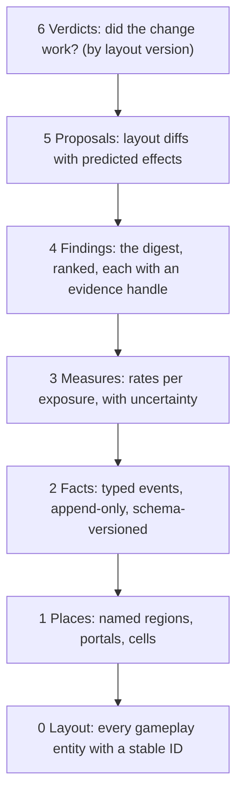

# The city map

Status: **design, agreed direction pending Tyler's go (2026-09-28)**. Heat v1 is live (see [the receipt](verification/heat-map-release-2026-09-28.md)). Everything else below is the plan unless marked *live*.

The city map is the single document for everything about the city: where things are, what happens there, how often, how dangerous, and what should change. People read it as the page at [/heatmap](https://ratdetective.online/heatmap) (to become `/map`). Agents read it as text, through this file and the live endpoints below. Both renderings come from the same data, so they can never disagree.

Tyler's brief (2026-09-28): track everything (pickups and their kinds, routes, cheese balls, when and where things go off), measure all of it, connect all of it, and make it readable at high fidelity. The aim is a deep, statistical understanding of how the game plays, so we can design the best map ever and keep it good for years.

## How to read the city: start here

1. **Ask the digest first:** `GET /api/city/v1/digest?days=7` returns a short Markdown reading of the map. It covers:
   - the exposure behind the numbers (human rat-hours and bot rat-hours);
   - dead zones and hot zones;
   - the most dangerous places and the spawns that kill;
   - pickups nobody takes;
   - where rats get stuck;
   - what changed since the last layout version, with confidence.

   Every line carries an **evidence handle** (for example `place:roof:records · measure:danger · days:7`) that the other endpoints answer exactly.
2. **Drill down by handle:** use `places`, `flows`, `timeline`, `events` and `cells` (see [Agent surfaces](#agent-surfaces)).
3. **Deep questions:** pull the raw archive into a local SQLite mirror (`output/city/city.db`) and query it. The `read` tool queries SQLite directly (`city.db?q=SELECT …`), so new questions need no new code.
4. **Change the city:** write a proposal (a layout diff), check it against the static analyses, ship it under a new layout version, and let the map judge it (see [The design loop](#the-design-loop)).

## The tower

Each layer is built only from the layer below and links back to it by ID. A finding points to measures, a measure to events, an event to a place, and a place to layout entities. Nothing floats free.

| Layer | Question it answers | Source of truth | ID shape |
| --- | --- | --- | --- |
| 0 Layout | What is where? | The shared layout modules, gathered behind one `cityModel()` | `pickup:alibi-records-upper`, `launcher:fan`, `pillar:gate`, `case-spawn:07`, `zone:sewer-junction`, `dest:sluice`, `entry:gate`, `lamp:31` |
| 1 Places | Which part of the city is this? | The place graph, derived from layout: streets split at junctions, alleys, block roofs, landmark floors and roofs, sewer halls, forecourts and yards | `street:seventy-ave:3`, `alley:central-w`, `roof:records`, `floor:needleworks:8`, `sewer:hall-east`, `district:north` |
| 2 Facts | What happened? | Events emitted by the room at the moment they happen | `event:<round>:<seq>` |
| 3 Measures | How much, how fast, how risky? | Deterministic projections of facts over places, versioned (`measureVersion`) | `measure:danger` |
| 4 Findings | What does it mean? | The digest's ranked statements | `finding:<hash>` |
| 5 Proposals | What should change? | Layout diffs in `design/city/proposals/` | `proposal:docks-v1` |
| 6 Verdicts | Did it work? | Before/after measures between layout versions | `verdict:docks-v1` |

**Key rule:** raw facts are kept forever, and measures are recomputed from them. A better metric invented next year can be answered for every past day. This is what makes the map build up value over time: nothing learned is ever thrown away, and nothing has to be re-collected.

## Frames and identity

- **Axes:** x runs east, z runs south, so **north is −z** and is drawn at the top.
  - Today the code disagrees with itself. The landmark wall named `north` faces +z, while `pursuit-north-avenue` sits at z −150.
  - The place graph fixes this: compass words come only from the frame, never from hand-written labels. The landmark wall names get renamed or mapped.
- **Floors** by height y:
  - `sewer` below −2;
  - `street` −2 to 5;
  - `upper` 5 to 45 (landmark floors at 8 and 16, roofs up to about 37);
  - `air` 45 and above (launch flights).
- **Cells:** 4 × 4 units, keyed `floor:ix:iz` where `ix = floor(x/4)`. Every cell belongs to exactly one place per floor.
- **Versions** stamped on every fact:
  - `layoutVersion`: today the world version, 2, bumped by any layout change;
  - `protocol`;
  - `schemaVersion`.
  - Measures carry a `measureVersion`.
- **Time:** UTC milliseconds, plus `roundMs` (time since the round went live). Days are UTC.
- **Actors:** an anonymous per-round actor number with `human` or `bot`. Never names, player IDs or tokens. A human keeps the same actor number through reconnects within the round, so their route stays one track.
- **Context** on every fact:
  - the assignment (`excessive-force`, `closing-time`, `chain-of-custody`, `jurisdiction`);
  - the active incident, if any;
  - the round phase;
  - the number of humans and bots present.

## Layer 0: what is on the map today

Counted from source on 2026-09-28, layout version 2:

| Entity | Count | Notes |
| --- | --- | --- |
| Landmarks | 5 | Records Hall (floors 0/8/16), Icebox (0/8), Needleworks (0/8/16), Pumping Station (0/8), Gate bridge |
| Street rectangles | 16 | City bounds −196 to 166 on both axes (362 units) |
| Buildings (collision boxes marked building) | 94 | Of 1,411 collision boxes |
| Landmark furnishings | 32 | Desks, crates, shelves |
| Sewer halls / entrances | 10 / 4 + manhole | Entrances: Gate, Icebox, Alley, Needleworks; manhole at (72, 0) |
| Pickup sites | 14 | 5 Ironclad (3 upstairs or roof, 1 sewer), 4 Hot Pursuit, 5 Quick Fix |
| Launchers | 6 | pressure, dumpster, freight, geyser, mousetrap, fan |
| Dispatch pillars | 9 | One in the sewer |
| Case spawns | 20 | Includes the home at (−16, −28) |
| Jurisdiction zones | 6 | 3 outdoor, 3 enclosed |
| Paper Chase destinations | 6 | Icebox, maintenance, pump, Needleworks, West Sluice, Records |
| Street lamps | 76 | |
| Player spawn points | about 820 | Generated street points with clearance |

**Known layout facts from the first map (2026-09-28):**
- The north strip (z < −102), about a quarter of the map, holds one Hot Pursuit and nothing else.
- The north-west holds one Quick Fix, one case spawn and one pillar.
- Rats clip through roofs at launcher landings and roof pickups.
- Bot routes are poor.

## Layer 2: every fact recorded

"Source" names where the fact already exists in code, so recording it is a matter of listening, not inventing. The volume column is a first estimate for 6–10 rats at all hours [INFERENCE; the first build measures it].

| Fact | Emitted when | Key fields | Source | Volume per day | Kept |
| --- | --- | --- | --- | --- | --- |
| `presence` | Every second per living, connected rat during play | position, floor, place, speed, heading, hp, carrying case, buffs, human/bot | room tick (heat v1 already samples this) | about 700k | aggregates in the room; raw in the archive |
| `spawn` | A rat enters play | spawn point, place, nearest rat's distance | join/respawn | about 10k | raw |
| `shot` | A trigger pull is accepted | origin, aim direction, pattern (Scattershot, Bad Ammunition), incident | `handleShoot` | 100k+ [INFERENCE] | aggregates; raw in the archive |
| `ball-end` | A cheese ball's life ends | end point, surface normal, outcome (`rat-body`, `rat-head`, `ironclad-reflect`, `case-contact`, `world-bounce`, `dispatch-contact`, `pressure-contact`, `fake-case`, `lifetime`), bounces, age | `drainShotEvents` (ShotResultEvent) | 100k+ | aggregates; raw in the archive |
| `damage` | A hit lands | attacker and victim positions and places, damage, headshot, explosive, incoming (corpse or case), ricochet count | `handleHit` | about 30k | raw |
| `death` | A rat dies | victim and killer positions and places, distance, cause (shot, headshot, explosion, trap, landing, case missile), incident, time alive, hp history | `handleHit` death branch | about 10k | raw |
| `pickup` | A site is claimed | site, kind, claimant, hp before, time since restock, distance travelled for it, buffs overwritten | `drainPickupEvents` (`collected`) | about 5k | raw |
| `restock` / `expire` | A site returns; a buff ends | site, kind; buff and remaining | pickup deadlines; buff clock | about 5k | raw |
| `heal` | Health is restored | cause (`pickup`, `incident`, `bounty`), amount | `drainPickupEvents` (`healed`) | about 3k | raw |
| `case` | The case changes hands or state | `take`, `drop`, `steal` (killed carrier), `loose`, `return`, `respawn`, `deliver`, with position, place, carry time, carry distance | chaos case transitions; assignment | about 5k | raw |
| `launch` | A machine or street vent throws | machine or vent, riders, overpressure, pressure at firing, trigger shooter | `PressureLaunchEvent` | about 3k | raw |
| `landing` | A launched rat touches down | landing point, place, airtime, apex, damage dealt, **inside-geometry check** | flight state on landing | about 3k | raw |
| `trigger` | A ball hits a pressure trigger | machine, shooter, pressure after | pressure contact outcome | about 20k | aggregates |
| `dispatch` | A pillar is rung; an incident starts or ends | pillar, caller, incident, duration, deaths during | dispatch state | about 1k | raw |
| `zone` | A Jurisdiction zone activates, is scored or rotates | zone, scorer, held milliseconds, contestants inside | assignment state | about 2k | raw |
| `round` | A round begins or ends | assignment, incident rotation, winner, method, duration, humans and bots, lineup | round and assignment | about 100 | raw |
| `session` | A human joins, leaves or reconnects | anonymous actor, platform (touch or desktop), length | join/leave | about 100 | raw |
| `anomaly` | A detector fires | `stuck` (alive, moving under 0.3 u/s for 8 s while not holding still on purpose), `inside-geometry` (feet inside a building box), `fell-through` (y below its floor), `out-of-bounds`, `landing-clip` | detectors on the presence stream | small | raw |

**Aggregates the room keeps live**, in SQLite, per UTC day, assignment and layout version:
- cells per layer: presence (human and bot), deaths, killer spots, ball ends by outcome, shots;
- place totals for every measure's numerator and exposure;
- place-to-place transitions;
- per-site pickup counts.

Heat v1's `heat_cells` becomes the cell part of this.

**The raw archive** holds every fact, hourly, as compressed JSON lines in R2 (`city/raw/YYYY/MM/DD/HH.jsonl.gz`), kept forever. First estimate: about 5 MB a day compressed, about 2 GB a year [INFERENCE]. The archive is private; public endpoints serve aggregates only.

## Layer 3: measures

Every rate is divided by its exposure and shown with its uncertainty. **Humans are the primary signal** and bots are reported separately, because bots are known to play badly until the bot overhaul.

| Measure | Definition | Reads as |
| --- | --- | --- |
| Use | place share of human rat-time ÷ place share of walkable area | Below 0.3 is a dead zone; above 3 is a magnet |
| Danger | deaths in place ÷ rat-minutes in place | How lethal it is to stand here |
| Lethality balance | kills made from place ÷ deaths suffered in place | Above 1 is a strong position (sniper roost); below 1 is a trap |
| Engagement | shots fired from place ÷ rat-minutes | How much fighting it produces |
| Accuracy by place | body and head hits ÷ shots, by shooter place and victim place | Cover quality and sightlines |
| Ball ends | ball ends by outcome per cell | Where cheese piles up, where it bounces, where it expires unused |
| Kill distance | distribution of killer-to-victim distance per place pair | Sightline length in practice |
| Flow | transitions per rat-hour between adjacent places | Routes actually used |
| Transit time | median seconds between two places, by route | How far things really are |
| Objective reach | median time from spawn to case, to each destination, to each zone | Whether objectives are fairly placed |
| Spawn safety | share of spawns that die within 5 s, or are damaged within 3 s | Bad spawn places |
| Pickup value | claims per hour, time from restock to claim, detour distance, holder's kills while buffed | Pickups nobody takes, or everyone camps |
| Launcher use | launches per hour per machine, landing spread, deaths within 5 s of landing, landing clips | Whether launchers are fun or broken |
| Case dynamics | loose time, carry distance, steal places, delivery route times | How the objective moves through the city |
| Zone contest | distinct rats inside per minute, scoring share | Whether a zone is a real fight |
| Dispatch | calls per pillar, deaths during each incident against baseline | Which pillars matter; which incidents bite |
| Stuck rate | anomaly counts per rat-hour per place | Collision bugs, including roof clipping |
| Bot divergence | Jensen–Shannon distance between the human and bot place-occupancy distributions (0 = same, 1 = unrelated) | The bot overhaul's scorecard |

**Statistical rules:**
- No finding from under 10 human rat-minutes in a place, or under 20 events.
- Rates carry Wilson intervals; counts carry Poisson intervals.
- Comparisons stay within one assignment, or weight assignments by their exposure.
- "Changed" means the intervals of the two layout versions do not overlap.
- Every measure states its exposure next to it.

## Static analyses: what the layout implies before anyone plays

These are computed from layers 0–1 alone. They are the priors, and telemetry tests them.

- **Area** per place and district.
- **Travel-time fields:** walking seconds from every cell to each spawn place, case spawn, destination, zone and pickup, over the navigation graph (including stairs, sewer and launch arcs).
- **Exposure raster:** for each street cell, how much of the city is in line of sight, from footprints and heights. Long open lanes show up before anyone dies in them.
- **Chokepoints:** the places with the highest betweenness on the place graph.
- **Vertical access:** how each roof and upper floor can be reached, and how long it takes.
- **Every place has a job:** a check that each district is used by at least one assignment objective, pickup or route.

## Agent surfaces

| Surface | Returns | Status |
| --- | --- | --- |
| `GET /api/heat/v1?days=…` | Cell heat (humans, bots, deaths, kills) | *Live*; stays as a compatibility view of the cell aggregates |
| `GET /api/city/v1/digest?days=…` | The Markdown reading described above | Plan |
| `GET /api/city/v1/model` | Layers 0–1: entities, places, portals and districts with IDs, bounds and adjacency | Plan (also written to `output/city/model.json` from source) |
| `GET /api/city/v1/places?days=…&assignment=…` | Measures per place with exposure and intervals | Plan |
| `GET /api/city/v1/flows?days=…` | Place-to-place transitions and transit times | Plan |
| `GET /api/city/v1/timeline?round=…` | One round's facts in order | Plan |
| `GET /api/city/v1/events?type=…&since=…` | Discrete facts, paged | Plan |
| `node scripts/city.mjs mirror` | Pulls the archive and aggregates into `output/city/city.db` for the agent | Plan; agents only. Tyler never needs a script |

The endpoints return compact JSON with the evidence handle on every row. The page and the digest are two renderings of the same responses.

## The page

`/heatmap` becomes **`/map`**, with the old address kept as an alias. It has three modes over the same canvas:

- **Observe:** any fact or measure as cells or as place shading. Adds timelines (scrub through a round), flow arrows between places, and per-place cards on hover.
- **Analyse:** the static analyses (travel-time fields, exposure, chokepoints, vertical access).
- **Design:** a proposal drawn over today's city, with its static analyses compared side by side. After it ships, before and after telemetry.

The brainstorm sketch (`output/city-map/city-map.html`: docks, precinct, north sewer branches) moves into Design mode as the first proposal.

## The design loop

1. **Read:** the digest names the problem, with evidence handles.
2. **Propose:** a layout diff with a stated goal and a predicted measure change. For example, "north district Use from 0.1 to above 0.6; Records forecourt Danger down 20%".
3. **Pre-check:** the static analyses on the proposal, plus a headless bot run (`scripts/benchmark-server-tick.mjs`) for smoke. Bot results count as evidence only once bot divergence is low.
4. **Ship:** under a new `layoutVersion`, with Tyler's OK.
5. **Judge:** a verdict compares the versions on the predicted measures and on everything else (no new dead zones or spawn traps). It is recorded under `design/city/verdicts/` and in Chartroom.

## Rules that keep the map true

- **A gameplay feature is not done until it emits its facts.** New pickup, machine, incident or zone means new or extended events, and a line in the table above.
- **Any layout change bumps `layoutVersion`.** Place IDs stay stable, or the change ships an old-to-new mapping.
- **Measures are pure functions of facts and places**, versioned, and recomputed rather than patched.
- **Recording stays cheap:**
  - at most 1% of room tick time, checked with the existing `work` counters;
  - bounded memory between flushes;
  - no work at all per cheese-ball bounce beyond the existing events.
- **Public surfaces carry counts only.** The raw archive is private.

## Build order (for approval)

1. **Places and frames.** `cityModel()` gathers layer 0. Build the place graph and the cell-to-place index. `GET /api/city/v1/model` and `output/city/model.json`. Fix the compass naming. *Acceptance:* every walkable cell on every floor maps to exactly one place; place areas sum to the walkable area.
2. **Facts.** Record all events in the table, with context and versions. Add the live aggregates, the anomaly detectors and the R2 archive.
   - *Acceptance:* failure-mode tests (bot versus human, corpses, disconnects, victory time, eviction, midnight, caps, schema version), plus measured tick cost under 1%.
   - Human play then builds up a baseline on today's city.
3. **Agent surfaces.** Digest, places, flows, timeline, events, and the mirror script. *Acceptance:* every digest line resolves through its handle; the mirror answers a query via `read`.
4. **The page, Observe mode.** Places, timelines, flows and cards.
5. **Static analyses and Analyse mode.**
6. **Design mode.** Proposals and verdicts. Then the city overhaul proper: layout decisions from evidence, the kit of reusable parts, the load-time lessons.
   - The bot overhaul uses the same places, navigation graph and bot divergence as its scorecard.

## Open decisions for Tyler

- **R2 archive:** a new private bucket bound to the Worker, to keep every raw fact forever. It costs cents per month at this volume [INFERENCE: confirm current R2 pricing]. Recommended: yes, since it is what lets new questions be answered about the past.
- **Public detail:** the page and aggregate endpoints stay public, as now; per-round timelines and events need a bearer token, as the private fixture's routes do. Recommended.
- **Order:** build steps 1–3 before continuing the layout brainstorm, so the redesign starts from evidence on today's city. Recommended.
