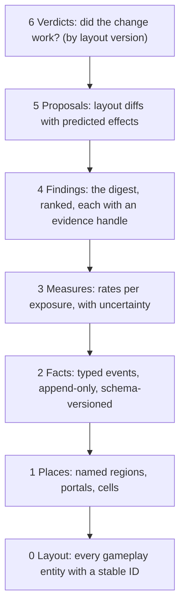

# The city map

Status (2026-09-29): **steps 1–3 are live** on production, Worker `00e3129e-6a33-40e0-acb8-f5810a251f60` (Tyler: "go ahead and deploy it to the live game"), then the recorder fixes in `a57db85b-bad7-483d-9dbf-51368235a768`, with the same client and protocol 22. See [the receipt](verification/heat-map-release-2026-09-28.md). **Steps 4–6 (the `/map` page's Observe, Analyse and Design modes) are built on branch `city/overhaul`** and ship with the overhaul. **First answer (Tyler's 12-minute Excessive Force session, 2026-09-29):** humans fire 176 shots per minute alive and hit 6%; bots fire 108 and hit 3%. Tyler clicks every shot (there is no hold-to-fire) and won 36/9/9. The session also exposed two recorder bugs, since fixed in source: every death was filed as `missile`, and sight stopped at 60 units.

**Layout 3 (2026-09-29):** built on `city/overhaul` and deployed to **staging only** (Worker `5aeb800a-dc54-467a-9825-b61408ace89f`, [staging `/map`](https://rat-detective-staging.mayberrydt.workers.dev/map)); staging's recorder writes layout-3 facts to `rat-detective-city-staging` (mirror with `node scripts/city-mirror.mjs --base=https://rat-detective-staging.mayberrydt.workers.dev --out=<dir>`). Production is still layout 2, so `proposal:overhaul-v3` waits for production play. Soak results: [the release receipt](verification/city-overhaul-release-2026-09-29.md).

The city map is the single document for everything about the city: where things are, what happens there, how often, how dangerous, and what should change. People read it as the page at [/map](https://ratdetective.online/map) (the old `/heatmap` address redirects there once the overhaul ships; production serves the old heat map at `/heatmap` until then). Agents read it as text, through this file and the live endpoints below. Both renderings come from the same data, so they can never disagree.

Tyler's brief (2026-09-28): track everything (pickups and their kinds, routes, cheese balls, when and where things go off), measure all of it, connect all of it, and make it readable at high fidelity. The aim is a deep, statistical understanding of how the game plays, so we can design the best map ever and keep it good for years.

## How to read the city: start here

1. **Ask the digest first:** `GET /api/city/v1/digest?days=7` returns a short Markdown reading of the map. It covers:
   - the exposure behind the numbers (human rat-hours and bot rat-hours);
   - dead zones and hot zones;
   - the most dangerous places and the spawns that kill;
   - pickups nobody takes;
   - where rats get stuck;
   - what changed since the last layout version, with confidence.

   Every line carries an **evidence handle** (for example `place:roof:records · measure:danger · days:7`) that the other endpoints answer exactly.
2. **Drill down by handle:** use `places`, `flows`, `timeline`, `events` and `cells` (see [Agent surfaces](#agent-surfaces)).
3. **Deep questions:** pull the raw archive into a local SQLite mirror (`output/city/city.db`) and query it. The `read` tool queries SQLite directly (`city.db?q=SELECT …`), so new questions need no new code.
4. **Change the city:** write a proposal (a layout diff), check it against the static analyses, ship it under a new layout version, and let the map judge it (see [The design loop](#the-design-loop)).

## The tower

Each layer is built only from the layer below and links back to it by ID. A finding points to measures, a measure to events, an event to a place, and a place to layout entities. Nothing floats free.

| Layer | Question it answers | Source of truth | ID shape |
| --- | --- | --- | --- |
| 0 Layout | What is where? | The shared layout modules, gathered behind one `cityModel()` | `pickup:alibi-records-upper`, `launcher:fan`, `pillar:gate`, `case-spawn:07`, `zone:sewer-junction`, `dest:sluice`, `entry:gate`, `lamp:31` |
| 1 Places | Which part of the city is this? | The place graph, derived from layout: streets split at junctions, alleys, block roofs, landmark floors and roofs, sewer halls, forecourts and yards | `street:seventy-ave:3`, `alley:central-w`, `roof:records`, `floor:needleworks:8`, `sewer:hall-east`, `district:north` |
| 2 Facts | What happened? | Events emitted by the room at the moment they happen | `event:<round>:<seq>` |
| 3 Measures | How much, how fast, how risky? | Deterministic projections of facts over places, versioned (`measureVersion`) | `measure:danger` |
| 4 Findings | What does it mean? | The digest's ranked statements | `finding:<hash>` |
| 5 Proposals | What should change? | Layout diffs in `design/city/proposals/` | `proposal:docks-v1` |
| 6 Verdicts | Did it work? | Before/after measures between layout versions | `verdict:docks-v1` |

**Key rule:** raw facts are kept forever, and measures are recomputed from them. A better metric invented next year can be answered for every past day. This is what makes the map build up value over time: nothing learned is ever thrown away, and nothing has to be re-collected.

## Frames and identity

- **Axes:** x runs east, z runs south, so **north is −z** and is drawn at the top.
  - Today the code disagrees with itself. The landmark wall named `north` faces +z, while `pursuit-north-avenue` sits at z −150.
  - The place graph fixes this: compass words come only from the frame, never from hand-written labels. The landmark wall names get renamed or mapped.
- **Floors** by height y:
  - `sewer` below −2;
  - `street` −2 to 5;
  - `upper` 5 to 45 (landmark floors at 8 and 16, roofs up to about 37);
  - `air` 45 and above (launch flights).
- **Cells:** 4 × 4 units, keyed `floor:ix:iz` where `ix = floor(x/4)`. Every cell belongs to exactly one place per floor.
- **Versions** stamped on every fact:
  - `layoutVersion`: today the world version, 2, bumped by any layout change;
  - `protocol`;
  - `schemaVersion`.
  - Measures carry a `measureVersion`.
- **Time:** UTC milliseconds, plus `roundMs` (time since the round went live). Days are UTC.
- **Actors:** an anonymous per-round actor number with `human` or `bot`. Never names, player IDs or tokens. A human keeps the same actor number through reconnects within the round, so their route stays one track.
- **Context** on every fact:
  - the assignment (`excessive-force`, `closing-time`, `chain-of-custody`, `jurisdiction`);
  - the active incident, if any;
  - the round phase;
  - the number of humans and bots present.

## Layer 0: what is on the map today

Counted from source on 2026-09-28, layout version 2; the job rows (pickup sites, pillars, case spawns, zones, destinations) recounted on 2026-09-29 after W6 of [the city overhaul](city-overhaul.md) spliced in the docks' and precinct's slots:

| Entity | Count | Notes |
| --- | --- | --- |
| Landmarks | 5 | Records Hall (floors 0/8/16), Icebox (0/8), Needleworks (0/8/16), Pumping Station (0/8), Gate bridge |
| Street rectangles | 16 | City bounds −196 to 166 on both axes (362 units) |
| Buildings (collision boxes marked building) | 94 | Of 1,411 collision boxes |
| Landmark furnishings | 32 | Desks, crates, shelves |
| Sewer halls / entrances | 10 / 4 + manhole | Entrances: Gate, Icebox, Alley, Needleworks; manhole at (72, 0) |
| Pickup sites | 16 | 5 Ironclad (Records upstairs, Icebox catwalk, Pump roof, Records forecourt street, precinct armoury), 4 Hot Pursuit, 7 Quick Fix |
| Launchers | 6 | pressure, dumpster, freight, geyser, mousetrap, fan |
| Dispatch pillars | 12 | One in the sewer, one upstairs in the precinct radio room |
| Case spawns | 30 | Includes the home at (−16, −28) |
| Jurisdiction zones | 11 | 7 outdoor, 4 enclosed; at least one in each of the nine districts |
| Paper Chase destinations | 8 | Icebox, maintenance, pump, Needleworks, West Sluice, Records, Harbour Master, Precinct Front Desk |
| Street lamps | 76 | |
| Player spawn points | about 820 | Generated street points with clearance |

**Known layout facts from the first map (2026-09-28):**
- The north strip (z < −102), about a quarter of the map, holds one Hot Pursuit and nothing else.
- The north-west holds one Quick Fix, one case spawn and one pillar.
- Rats clip through roofs at launcher landings and roof pickups.
- Bot routes are poor.

## Layer 2: every fact recorded

The schema is `src/shared/city/facts.ts` (`CITY_SCHEMA_VERSION` 1). Every fact carries `t` (UTC ms), `rm` (ms since the round went live), `room`, `round`, `layout`, `schema`, `mode` (the assignment) and `incident`. Positions are rounded to 0.1 units. Actors are per-round numbers; no names or IDs are stored.

| Fact | Emitted when | Key fields | Kept |
| --- | --- | --- | --- |
| `frame` | Every second while a human is connected; every 5 s in the bot-only city | the world's situation plus every connected rat's situation (see below) | archive |
| `window` | 3 s before to 2 s after any damage, merged while a fight continues | per actor, 5 samples a second of `[ms, x, y, z, yaw, hp]` | archive |
| `spawn` | A rat enters play | point, place, nearest rival | archive, SQL, counts |
| `shot` | A human's trigger pull is accepted | origin, place, aim, gap since their last shot | archive, SQL, counts. **Bots' shots are counts only**, because they fire about 100 times a minute each |
| `ball` | A human's cheese ball hits a rat, a case, a bell, a trigger, a counterfeit, a coat, or runs out of time | outcome, point, place, victim | archive, SQL; **every ball of every rat**, bounces included, is counted in cells by outcome |
| `damage` | A hit lands | attacker and victim, positions, damage, headshot, explosive, missile, distance, health after | archive, SQL |
| `death` | A rat dies | killer and victim positions and places, distance, cause (`shot`, `headshot`, `explosion`, `missile`, `city`), time alive, assists | archive, SQL, counts |
| `pickup` / `restock` / `heal` / `buff-end` | A site is claimed or returns; health is restored; a buff runs out | site, kind, place, health before, time the site sat full; heal cause | archive, SQL, counts |
| `case` | `take`, `drop`, `steal`, `deliver`, `respawn` | who, from whom, point, place, carry time | archive, SQL, counts |
| `launch` / `landing` | A machine throws; the rider comes down | machine, overpressure, landing place, airtime, apex, **landed inside geometry** | archive, SQL, counts |
| `dispatch` | Dispatch changes phase or incident | phase, incident, caller, pillar rung, Most Wanted | archive, SQL |
| `zone` | A Jurisdiction zone activates or changes scorer | zone, scorer | archive, SQL |
| `round` | A round starts or ends | humans, bots; winner, method, duration, every rat's final standing and K/D/A | archive, SQL |
| `session` | A human joins or leaves | actor | archive, SQL |
| `anomaly` | `inside-geometry`, `fell-through`, `out-of-bounds` (at most once per 10 s per rat) | point, place | archive, SQL, counts |

### The situation: what every rat faces, every second

Defined once in `src/shared/city/facts.ts` (`RatSituation`, `WorldSituation`), with K/D/A and standings in `src/shared/city/ledger.ts`. The future AI is meant to learn from exactly this view. The bots will be redone from scratch; they can read the same definition, or the definition can change with them under a new schema version.

- **The rat:** position, floor, place, velocity, yaw, aim pitch, health, alive, respawn countdown, time alive.
- **Pickups on it:** Ironclad and Hot Pursuit time left; its last pickup and how long ago.
- **Case:** carrying it and for how long; distance to the case; distance to the current objective (Paper Chase destination, Jurisdiction zone, or the case).
- **Standing:** `progress` (its fraction of the win: deliveries out of 3, zone time out of 60 s, case kills out of 10, Closing Time case time as a share of the best), `rank` (ties broken by kills), `lead` (against the nearest rival; negative when behind), `raw`.
- **K/D/A this round:** kills, deaths, assists, streak, damage dealt and taken, headshots, shots, hits. **An assist** is damage dealt to a victim in the 10 s before someone else (or the city) killed it.
- **Shooting:** trigger pulls in the last 10 s and time since the last one.
- **Danger:** rivals in line of sight within 60 units, the nearest rival's distance, when it was last hit and by whom, and whether it is Most Wanted.
- **The world:** the case (holder, loose, returning, place, time since it changed hands, decoys), Dispatch (phase, incident, time left, caller, Most Wanted), every pickup site's restock countdown, every machine's pressure, the Jurisdiction zone (time left, who is inside, scorer), and how many humans, bots, corpses and balls are in play.

**Episodes:** a round is an episode and each life (spawn to death) a smaller one. Outcomes attach to situations by time: died within N s, got the kill, took the pickup, won the round.

**Aggregates the room keeps live**, in SQLite, per UTC day, layout version and assignment, and kept forever:
- `city_cells`: cells per layer. The layers are `humans` and `bots` (seconds), `deaths`, `kills`, `spawns`, `pickups`, `landings`, `anomalies`, `shots-human`, `shots-bot`, and `ball-<outcome>` for every ball of every rat.
- `city_places`: per place, `human-s`, `bot-s`, `still-human-s`, `still-bot-s`, `deaths`, `deaths-human`, `deaths-bot`, `kills`, `kills-human`, `kills-bot`, `kill-dist-dm`, `shots-human`, `shots-bot`, `hits-human`, `hits-bot`, `bank-hits-human`, `bank-hits-bot` (hits that came off a wall first), `spawns`, `spawn-deaths-5s`, `pickup:<kind>`, `launches`, `landings`, `landing-clips`, `case-take`, `case-drop`, `case-steal`, `deliveries`, `anomaly:<what>`.
- `city_flows`: place-to-place transitions, by humans and by bots.

Discrete facts also sit in `city_events` for 30 days. Heat v1's tables were folded into `city_cells` by the migration.

**The raw archive:** R2 bucket `rat-detective-city` (staging `rat-detective-city-staging`), keys `city/raw/v1/<room>/YYYY/MM/DD/HH-mm-ss-<id>.jsonl.gz`. It is flushed every 5 minutes, at 2 MB, and when the city stops, and kept forever. An eviction loses at most the buffer.

**Measured cost** (`node scripts/benchmark-server-tick.mjs --city`, 9 bots, 2 minutes):
- the recorder costs 0.01–0.02 ms a tick, 1–2% of the benchmark's tick, over the 1% aim;
- the trajectory hash is unchanged, so recording does not alter the game;
- the bot-only city archives about 6.5 MB a day compressed, about 2.4 GB a year;
- human play adds 1 Hz frames and every human shot while it lasts.

## Layer 3: measures

Every rate is divided by its exposure and shown with its uncertainty. **Humans are the primary signal** and bots are reported separately, because bots are known to play badly until the bot overhaul.

| Measure | Definition | Reads as |
| --- | --- | --- |
| Use | place share of human rat-time ÷ place share of walkable area | Below 0.3 is a dead zone; above 3 is a magnet |
| Danger | deaths in place ÷ rat-minutes in place | How lethal it is to stand here |
| Lethality balance | kills made from place ÷ deaths suffered in place | Above 1 is a strong position (sniper roost); below 1 is a trap |
| Engagement | shots fired from place ÷ rat-minutes | How much fighting it produces |
| Accuracy by place | body and head hits ÷ shots, by shooter place and victim place | Cover quality and sightlines |
| Ball ends | ball ends by outcome per cell | Where cheese piles up, where it bounces, where it expires unused |
| Kill distance | distribution of killer-to-victim distance per place pair | Sightline length in practice |
| Flow | transitions per rat-hour between adjacent places | Routes actually used |
| Transit time | median seconds between two places, by route | How far things really are |
| Objective reach | median time from spawn to case, to each destination, to each zone | Whether objectives are fairly placed |
| Spawn safety | share of spawns that die within 5 s, or are damaged within 3 s | Bad spawn places |
| Pickup value | claims per hour, time from restock to claim, detour distance, holder's kills while buffed | Pickups nobody takes, or everyone camps |
| Launcher use | launches per hour per machine, landing spread, deaths within 5 s of landing, landing clips | Whether launchers are fun or broken |
| Case dynamics | loose time, carry distance, steal places, delivery route times | How the objective moves through the city |
| Zone contest | distinct rats inside per minute, scoring share | Whether a zone is a real fight |
| Dispatch | calls per pillar, deaths during each incident against baseline | Which pillars matter; which incidents bite |
| Stuck rate | anomaly counts per rat-hour per place | Collision bugs, including roof clipping |
| Bot divergence | Jensen–Shannon distance between the human and bot place-occupancy distributions (0 = same, 1 = unrelated) | The bot overhaul's scorecard |

**Statistical rules:**
- No finding from under 10 human rat-minutes in a place, or under 20 events.
- Rates carry Wilson intervals; counts carry Poisson intervals.
- Comparisons stay within one assignment, or weight assignments by their exposure.
- "Changed" means the intervals of the two layout versions do not overlap.
- Every measure states its exposure next to it.

## Static analyses: what the layout implies before anyone plays

These are computed from layers 0–1 alone. They are the priors, and telemetry tests them. Built in `src/shared/city/analysis.ts` on a 1-unit street grid from the collision boxes (`StreetGrid`: solids above a rat's hop height stop a walk, solids across eye height stop sight, solids across mid-body are cover, cell bars stop a walk but neither sight nor cheese, tilted ramps and stairs are walkable, the harbour is water except under decks), sampled on the map's 4-unit cells:

- **Exposure raster** (`sightlines`): for each street cell, the open ground in view and the longest clear line, 32 directions at eye height up to 180 units. Long open lanes show up before anyone dies in them.
- **Cover density** (`coverDensity`): the share of ground within 6 units that shields a body.
- **Travel-time field** (`travelSeconds`, `travelField`): running seconds (18 units a second, no corner cutting) from every street cell to the nearest objective (case spawn, supply, pillar, zone, Paper Chase stop; upstairs ones from the street below, sewer ones left out), and **spawn-to-objective** medians per district (`spawnReach`).
- **Cut-off ground** (`islands`): street cells that cannot be walked to from the main network.
- **Chokepoints** (`chokepoints`): the betweenness of each street place on the graph of places that touch.
- **Every place has a job** (`jobs`): case spawns, supplies, pillars, zones, stops and spawn points per district; a district with no objective is stamped NO JOB.
- Not built yet: routes through stairs, the sewer and launch arcs, and the vertical-access table (how each roof and upper floor is reached, and how long it takes).

## Agent surfaces

All ranges take `days=1–3650`, `days=all`, or `from` and `to` (UTC days); aggregates also take `mode=` and `layout=`. Built in `src/worker/city/cityApi.ts`.

| Surface | Returns | Status |
| --- | --- | --- |
| `GET /api/heat/v1` | Every cell layer | Live |
| `GET /api/city/v1/digest` | The Markdown reading, with evidence handles | Built |
| `GET /api/city/v1/model` | Layers 0–1: every layout entity and every place (262 in layout 3; 196 in layout 2) with IDs, kinds, names, areas and centres | Built |
| `GET /api/city/v1/places` | Summed place counts, and human time by assignment | Built; rates come from `src/shared/city/measures.ts` |
| `GET /api/city/v1/flows` | Place-to-place transitions by humans and bots | Built |
| `GET /api/city/v1/events?type=&round=&since=&limit=` | Discrete facts from the last 30 days (a round's timeline is `round=`) | Built; bearer `CITY_TOKEN` |
| `GET /api/city/v1/archive?prefix=&cursor=`, `/archive/<key>` | The raw archive listing and objects | Built; bearer `CITY_TOKEN` |
| `node scripts/city-mirror.mjs [--base=…]` | Mirrors the model, aggregates and every archived fact into `output/city/city.db`: tables `facts`, `situations` (one row per rat per frame), `place_counts`, `flows`, `cells`, `places`, `entities` | Built; agents only. The token is in `~/.config/rat-detective/city-token` on Veelox and Halla |
| `/map` (alias `/heatmap`, a 301 that keeps the query) | The page below: the same public endpoints, drawn | Built on `city/overhaul`; production still serves the old `/heatmap` page until the overhaul ships |
| `design/city/proposals/*.json`, `design/city/layouts/*.json` | Proposals (goals, predictions as measures) and layout snapshots for diffs | Built; parsed by `parseProposal`, judged by `judge` in `src/shared/city/verdict.ts` |

Query the mirror with `read output/city/city.db?q=SELECT …`.

## The page

**`/map`** (`map.html`, `src/map/`), with `/heatmap` kept as an alias: the Worker answers `/heatmap` and `/heatmap.html` with a 301 to `/map`, query intact (`run_worker_first` lists `/heatmap`). The city is drawn from the shared layout modules (graybox and kit colliders, `CITY_STREETS`, `kitCity().water`, piers, sewer halls, the jobs registries), so layout 3 shows as built. Every choice lives in the URL, so a refresh keeps the view; the open mode reloads its data every minute. `?api=https://ratdetective.online` points a local build at production's public endpoints. Three modes over one canvas:

- **Observe** (`observe.ts`): any recorded layer (human and bot time, deaths, killer spots, shots, cheese bounces, hits and run-outs, pickups, landings, spawns, faults) as 4-unit cells or shaded per place, by floor, date range, layout and assignment. Upper floors, rooms, roofs, lookouts and the chutes are chips at their building (8, 16, R, L, C). Flow arrows between places and the overlays (sewer, supplies, case spawns, launchers, pillars, zones, stops). Hover for a place card with its counts. Counts under retired layout-2 IDs fold into the place that now holds that ground (`PLACES.successor`).
- **Analyse** (`analyse.ts`): the static analyses above as layers (continuous ones shaded by rank, so a city of long streets still shows its most exposed cells), and the measures per place: use, danger to humans, danger for all rats, lethality, human and bot fire rates, banked-hit share for humans and bots, spawn traps and bot divergence (per place, and the Jensen–Shannon distance for the whole city). Each shows its 95% interval and exposure; a place under the minimums (10 human rat-minutes, or 20 events for counted measures) is drawn faint and left out of the table. The digest is shown as written.
- **Design** (`design.ts`): every proposal in `design/city/proposals/`, each prediction's reading on the layout before and the layout after (`/api/city/v1/places?layout=`), stamped *waiting for play*, *met*, *missed* or *too close to call*; the footprint diff against the proposal's baseline snapshot (added, removed, kept; Before and After views); and the static analyses of both layouts side by side (walkable ground, the north third's share, cut-off ground, median sightline and cover).
- Not built: scrubbing a round's timeline. Round facts are behind the token (`events?round=`), and the page uses only public endpoints.

`proposal:overhaul-v3` is the first proposal: the layout-3 overhaul, with five predictions (north share of human time up, banked-hit share up, the west third's share of deaths up, the case's Needleworks-upstairs share down, Ironclad claims per rat-hour up). A prediction is judged only when both layouts have 30 human rat-minutes (`VERDICT_HUMAN_SECONDS`) and enough events, and called only when the 95% intervals part; play time counts in minutes, not seconds, so an hour is not 3,600 trials.

The brainstorm sketch (`output/city-map/city-map.html`: the docks, the Panopticon precinct, north sewer branches, the Gate–precinct route, cut junction corners, landmark bank walls, the Needleworks chute and Ironclad moves; agreed 2026-09-29, see [the juice plan](juice-plan.md)) became that proposal. The overhaul itself is built in one run from [the city overhaul plan](city-overhaul.md); afterwards the layout is tuned from data for at least a week, one `layoutVersion` per adjustment.

## The design loop

1. **Read:** the digest names the problem, with evidence handles.
2. **Propose:** a layout diff with a stated goal and a predicted measure change. For example, "north district Use from 0.1 to above 0.6; Records forecourt Danger down 20%".
3. **Pre-check:** the static analyses on the proposal, plus a headless bot run (`scripts/benchmark-server-tick.mjs`) for smoke. Bot results count as evidence only once bot divergence is low.
4. **Ship:** under a new `layoutVersion`, with Tyler's OK.
5. **Judge:** a verdict compares the versions on the predicted measures and on everything else (no new dead zones or spawn traps). It is recorded under `design/city/verdicts/` and in Chartroom.

## Rules that keep the map true

- **A gameplay feature is not done until it emits its facts.** New pickup, machine, incident or zone means new or extended events, and a line in the table above.
- **Any layout change bumps `layoutVersion`.** Place IDs stay stable, or the change ships an old-to-new mapping.
- **Measures are pure functions of facts and places**, versioned, and recomputed rather than patched.
- **Recording stays cheap:**
  - at most 1% of room tick time, checked with `benchmark-server-tick.mjs --city` (today 1–2%; the next saving is building frames less often);
  - bounded memory between flushes;
  - no work at all per cheese-ball bounce beyond the existing events.
- **Public surfaces carry counts only.** The raw archive is private.

## Build order

1. **Places and frames (built).** `src/shared/city/frame.ts`, `places.ts` (196 places: 60 street stretches, 28 junctions, 32 lots, 45 rooftop groups, 10 landmark floors and roofs, 2 Gate places, 10 sewer places, 9 air districts), `model.ts`. The landmark wall names are left as they are; the frame defines compass words. Originally: `cityModel()` gathers layer 0. Build the place graph and the cell-to-place index. `GET /api/city/v1/model` and `output/city/model.json`. Fix the compass naming. *Acceptance:* every walkable cell on every floor maps to exactly one place; place areas sum to the walkable area.
   - **Layout 3** (W9 of [the city overhaul](city-overhaul.md)) names the new north: `quay:0`–`quay:2` (the quay edge, split where streets meet it), `pier:m20`, `pier:20`, `pier:70`, `pier:breakwater`, `boat:deck` and `boat:bridge`, `water:harbour` (anything below quay level over the harbour), `yard:containers` and `yard:containers:top`, `floor:pier9:0`, `floor:pier9:5` (catwalk) and `roof:pier9`, `floor:precinct:0/8/16` and `roof:precinct`, `floor:cellblock:0/8/16` and `roof:cellblock`, `yard:cellblock`, `grounds:precinct`, `landmark:cellblock-tower`, `lookout:tower`, `lookout:cranes`, `exit:precinct-sewer`, `exit:docks-sewer`, `street:gate-lane:*`, `street:quay-road:*`, `chute:needleworks:8` and `:16`, and one `room:<id>` per kit room in the north (`kitCity().rooms`: the precinct's lobby, lockup, radio room, armoury and the rest, the harbour master, the Marlowe's cabin and bridge). 262 places.
   - **IDs stay stable.** Layout-2 streets, junctions, landmarks and sewer halls keep their IDs (their stretches are still counted at layout-2 crossings). Lots and rooftops are numbered by size, so each keeps its ID while its group still holds its layout-2 anchor cell and half its old cells (`src/shared/city/legacyPlaces.ts`, generated from layout 2); a retired one maps to the place that now holds that anchor (`successor`), and the page and verdicts fold old counts through it. Layout 3 retires 17 of layout 2's 196 IDs, all lots or rooftops that the docks, the precinct and Gate Lane were built over. A place spanning districts is filed where its centre lies.
2. **Facts (built).** `src/worker/city/CityRecorder.ts`, `CityStore.ts`, `CityArchive.ts`, hooked into `GameRoom`. Originally: record all events in the table, with context and versions. Add the live aggregates, the anomaly detectors and the R2 archive.
   - *Acceptance:* failure-mode tests (bot versus human, corpses, disconnects, victory time, eviction, midnight, caps, schema version), plus measured tick cost under 1%.
   - Human play then builds up a baseline on today's city.
3. **Agent surfaces (built).** Originally: digest, places, flows, timeline, events, and the mirror script. *Acceptance:* every digest line resolves through its handle; the mirror answers a query via `read`.
4. **The page, Observe mode (built on `city/overhaul`).** Places, flows and cards; round timelines are left to agents (`events?round=`, token).
5. **Static analyses and Analyse mode (built on `city/overhaul`).** Vertical access and routes through stairs, sewer and launchers are still to come.
6. **Design mode (built on `city/overhaul`).** Proposals and verdicts; `proposal:overhaul-v3` is the first. Then the city overhaul proper: layout decisions from evidence, the kit of reusable parts, the load-time lessons.
   - The bot overhaul uses the same places, navigation graph and bot divergence as its scorecard.

## Decisions (Tyler, 2026-09-28)

- **R2 archive:** yes. The buckets `rat-detective-city` and `rat-detective-city-staging` were created on 2026-09-29.
- **Assists:** damage in the 10 s before someone else's kill.
- **Sampling:** once a second, plus 5-a-second windows around every fight. The bot-only city records every 5 s.
- **Bots:** they will be redone entirely ("in a way you can't even imagine"). The situation stays a shared definition they may use, not a constraint on them.
- **Shooting:** measure how often humans and bots shoot (Tyler, 2026-09-29). This covers the counts and cells by who, fire rate in every situation, shots in K/D/A, and the digest's shots per minute.
- **Shooting is always good** (Tyler, 2026-09-29): there is no downside to firing except that rivals hear it. Cheese banks off walls, so firing with nobody in view is round-corner fire at where a rat might be, not waste; the Hunch (seeing through walls at full health) makes those bank shots aimed. The recorder counts banked hits (`bank-hits-*`, `bounces` on a human's ball facts). The chaos and the volume of cheese are wanted; 5 HP exists so a rat can stay in the fight and take hits. Do not treat blind fire or low hit rates as problems to reduce.
- **The bot overhaul will surprise us (Tyler, 2026-09-29):** "we're going to redo bots in a way you can't even imagine, and it's gonna completely change the way you're thinking." Design the city for the game's rules and for human play, not around today's bots or guesses about tomorrow's.
- **Bot skill ceiling:** bots must not outplay Tyler (a former collegiate League of Legends player) in the base game; their current level is about right. A separate "nightmare" difficulty could be fun later. The overhaul is about moving and playing more like humans, not about being stronger.
- **Needleworks in the first session was an anomaly:** the case got stuck on its second floor and rats died there repeatedly retrieving it. Do not read that round's Needleworks heat as normal.
- **Public detail:** aggregates and the page are public; events and the archive need the token.
