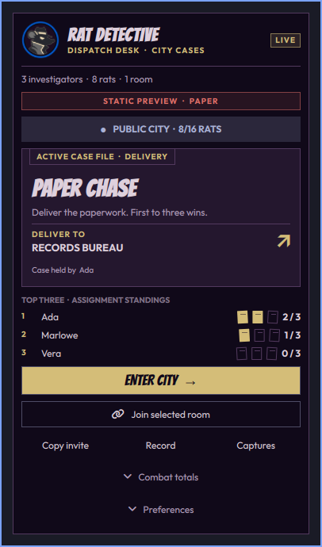

# Rat Detective Dispatch

A desktop companion for [Rat Detective](https://ratdetective.online/), the browser
shooter about rats, paperwork and ricocheting cheese. The game runs in your browser;
the companion shows city activity and handles desktop conveniences.



*Rat Detective appearance, static fixture on Omarchy 4.0.3; no gameplay is running in this preview. Omarchy appearance is the default.*

## What it does

- Follows your Omarchy theme by default, with an optional Rat Detective noir appearance.
- Shows active public rooms and the current Dispatch Assignment.
- Displays paperwork deliveries, zone points, qualifying case kills or the Closing
  Time clock. Combat totals stay secondary.
- Returns to an existing game window or launches the game. Joining a selected room
  is a separate action that preserves an existing session.
- Offers optional alerts, recording controls, saved captures and invitation links.
- Marks unavailable or old information instead of displaying a misleading zero.

Omarchy 4.0.3 is the initial integration target. Python 3, curl, Hyprland and
Omarchy's supported web-app browser are required. Clipboard actions use wl-copy;
recording uses Omarchy's installed recorder. Missing capabilities produce an error
without changing the game. Brave app-window identity, focus and fullscreen were verified on Hyprland 0.56
with a silent static page. Other browsers and actual recording/game input still
need human verification.

## Install and update

Install the published plugin repository:

```sh
omarchy plugin add https://github.com/MayberryDT/rat-detective-omarchy.git --enable
```

Open the bar chip, then use Add to menu to install the desktop launcher. Enabling
the plugin alone does not install or launch the game. Existing users can repair
the old-domain launcher from the panel. The launcher is available from Super+Space.

```sh
omarchy plugin update co.animasai.rat-detective
```

If the current shell keeps an older QML component after an update, use the
supported `omarchy restart shell` command. This refreshes the desktop shell.

Source development stays in the game's `omarchy/plugin/` directory. Published
releases are reproducible exports; `release.json` records hashes of packaged files.
The game repository's `scripts/omarchy-release.mjs` also supports staged local
installation and rollback for development or migration from a manual folder copy.

## Appearance

Open **Preferences → Appearance** and choose **Omarchy** or **Rat Detective**.
Omarchy is the default, including existing installations. It follows your live
popup colors and shell font. Rat Detective uses midnight purple, lavender and
brass, with the game’s Bangers display lettering and Outfit body text. Both modes
share the same layout; the bar and outside popup frame retain your native theme.
The choice saves on this widget and applies immediately without changing your
global theme or restarting the game, recording or service.

The badge comes from the game. The symbolic rat-head icon is the selected angular
profile A, implemented as a clean, theme-tinted SVG. It uses the host bar icon
canvas and thickness, stacks its count on vertical bars, and rasterizes at the
current display scale. The widget supports stock and custom Omarchy 4 bars that
implement the standard bar-widget API. Stock Omarchy and the custom bar were
checked in all four positions; layout tests cover 16–64px thickness and 1×–3×
scales. This QML plugin does not target legacy Waybar. Fonts are bundled locally under the SIL Open Font License; see
[asset credits](assets/README.md). No fonts are downloaded at runtime.

## Desktop controls

The panel provides ordinary controls. The same adapter is available for scripts:

```sh
python3 scripts/rat-detective-desktop.py status
python3 scripts/rat-detective-desktop.py return
python3 scripts/rat-detective-desktop.py copy-link
python3 scripts/rat-detective-desktop.py preferences --workspace=current --fullscreen=false
```

`return` focuses an identified game window without reloading it. A new window does
not inherit another tab's reconnect credential. `join ROOM` opens an explicit room
invitation; if the room fills or expires, the game explains its matchmaking fallback.

Workspace, fullscreen and desktop-recording audio are optional. Notification
settings start disabled. Alerts use fresh transitions, cooldowns and quiet hours;
they stay quiet when the game is focused. The companion does not alter global DND,
lock settings or the game's audio mix. Recording starts only from an explicit
control; microphone capture is not enabled. Files stay local.

A shortcut can be installed with `shortcut-install 'SUPER + SHIFT + F9'` (choose an
unused chord) and removed with `shortcut-remove`. Installation rejects conflicts,
backs up the affected configuration and validates Hyprland. This example is not a
recommendation to replace an existing binding.

## Remove

```sh
omarchy plugin disable co.animasai.rat-detective
omarchy plugin remove co.animasai.rat-detective
```

The separately installed game launcher remains usable after plugin removal. To
remove it too, run its durable helper:

```sh
python3 ~/.local/share/rat-detective/rat-detective-desktop.py uninstall-launcher
```

Remove an installed shortcut with `shortcut-remove` before removing the launcher.
Disabling the plugin stops its polling and alerts. It does not stop a recording
that the user started or delete captures.

## Development and compatibility

Validate a source or exported package using `omarchy plugin validate PATH`.
The versioned companion HTTP API is independent of the gameplay WebSocket protocol.
Older servers retain a limited legacy panel; assignment features require the new
companion endpoint. Public summaries contain no positions or reconnect credentials.
Polling the city directory does not start gameplay, reserve slots or create bots.

[Game source and implementation evidence](https://github.com/MayberryDT/rat-detective-online)

## Tests, previews and support

Run `tests/run` from a fresh checkout (Node.js 22+, Python 3 and Bash). These
portable checks cover normalized room data, clocks, freshness and alert policy;
they never launch a browser or record the desktop. Live QML checks require the
installed Omarchy imports and are documented in the release notes.
Run `tests/run-qml` with Qt 6 QtQuick/QtTest installed to check the actual
appearance component against narrow, mutable native-role stubs.

For a deterministic visual inspection, use `omarchy-shell
co.animasai.rat-detective fixture paper` and then `open` on the same target.
Fixtures include `paper`, `jurisdiction`, `excessive`, `closing`, `empty`, `stale`,
`unavailable` and `loading`. They are labeled STATIC PREVIEW and suppress desktop
actions and alerts. Always clear the fixture with `fixture ""` and close the panel
afterward. Capture only the panel on an empty workspace.

[Report an issue](https://github.com/MayberryDT/rat-detective-omarchy/issues).
For sensitive security reports, use the repository's private vulnerability
reporting channel when available; do not include credentials or private captures
in public issues. Static validation is not a security audit.
